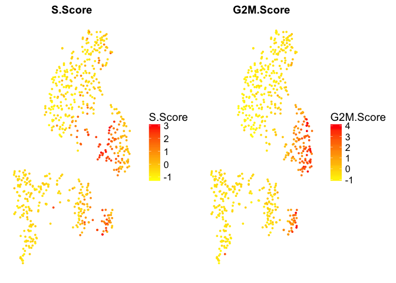

Run Seurat analysis to cluster the grafting data, split the before and after grafting cells into separate analyses.

### Load packages

``` r
suppressMessages(library(Seurat))
```

    ## Warning: package 'Seurat' was built under R version 3.4.4

    ## Warning: package 'cowplot' was built under R version 3.4.3

    ## Warning: package 'Matrix' was built under R version 3.4.4

``` r
suppressMessages(library(gridExtra))
```

### Read data

``` r
# read rpkm values
R <-read.table("../data/ensembl_rpkms_filtered.csv", sep=",", header=T)

# read in meta data table
M <- read.table("../data/metadata_all_filtered.csv", sep=",",header=T)
```

Run Seurat for after grafting
=============================

Use Seurat to extract variable genes and scale data by gene detection.

``` r
after <- grep("after",M$plate)

savefile<-"../data/seurat_object_after.Rdata"
if(file.exists(savefile)){
  load(savefile)
}else{

  
  dataS <- CreateSeuratObject(raw.data = R[,after], min.cells = 3, min.genes = 200, 
    project = "after_grafting",is.expr=1,meta.data=M[after,])

  scale.factor <- mean(colSums(R[,after]))
  dataS <- NormalizeData(object = dataS, normalization.method = "LogNormalize", 
    scale.factor = scale.factor)

  # variable genes
  dataS <- FindVariableGenes(object = dataS, mean.function = ExpMean, dispersion.function = LogVMR, x.low.cutoff = 1, x.high.cutoff = 10, y.cutoff = 1,cex.text.use=0.2)

  length(x = dataS@var.genes)

  # regress out number of detected genes.d
  dataS <- ScaleData(object = dataS, vars.to.regress = c("nGene"),display.progress=F)

  #PCA
  dataS <- RunPCA(object = dataS, pc.genes = dataS@var.genes, do.print = FALSE)

  #Determine statistically significant principal components
  dataS <- JackStraw(object = dataS, num.replicate = 100, do.print = FALSE)
  JackStrawPlot(object = dataS, PCs = 1:20)


  # select PCs based on JackStraw - all first 12 look fine.
  use.pcs <- 1:12
  dataS <- FindClusters(object = dataS, reduction.type = "pca", dims.use = use.pcs, 
    resolution = 0.6, print.output = 0, save.SNN = TRUE)

  #tSNE

  dataS <- RunTSNE(object = dataS, dims.use = use.pcs, do.fast = TRUE)
  save(dataS,file=savefile)

}

# plot tSNE, define color scale
TSNEPlot(object = dataS,do.label = T, colors.use = c("deepskyblue","blue2","green4","green1","greenyellow","red1","magenta"))
```


``` r
# also plot by cell origin
TSNEPlot(object = dataS, group.by = "sample_type", colors.use = c("red", "blue"))
```


Run Seurat for before grafting
==============================

``` r
before <- grep("before",M$plate)

savefile<-"../data/seurat_object_before.Rdata"
if(file.exists(savefile)){
  load(savefile)
}else{

  
  dataSA <- CreateSeuratObject(raw.data = R[,before], min.cells = 3, min.genes = 200, 
    project = "after_grafting",is.expr=1,meta.data=M[before,])

  scale.factor <- mean(colSums(R[,before]))
  dataSA <- NormalizeData(object = dataSA, normalization.method = "LogNormalize", 
    scale.factor = scale.factor)

  # variable genes
  dataSA <- FindVariableGenes(object = dataSA, mean.function = ExpMean, dispersion.function = LogVMR, x.low.cutoff = 1, x.high.cutoff = 10, y.cutoff = 1,cex.text.use=0.2)

  length(x = dataSA@var.genes)

  # regress out number of detected genes.d
  dataSA <- ScaleData(object = dataSA, vars.to.regress = c("nGene"),display.progress=F)

  #PCA
  dataSA <- RunPCA(object = dataSA, pc.genes = dataSA@var.genes, do.print = FALSE)

  #Determine statistically significant principal components
  dataSA <- JackStraw(object = dataSA, num.replicate = 100, do.print = FALSE)
  JackStrawPlot(object = dataSA, PCs = 1:20)


  # select PCs based on JackStraw - skip pc 7 & pc9
  use.pcs <- c(1:6,8,10:12)
  dataSA <- FindClusters(object = dataSA, reduction.type = "pca", dims.use = use.pcs, 
    resolution = 0.6, print.output = 0, save.SNN = TRUE)

#tSNE
  dataSA <- RunTSNE(object = dataSA, dims.use = use.pcs, do.fast = TRUE)
  save(dataSA,file=savefile)
}
# by seurat cluster, define color scale
TSNEPlot(object = dataSA,do.label = T, colors.use = c("green","orange","cyan","yellow2","green4"))
```


``` r
# by plate
TSNEPlot(object = dataSA, group.by = "sample_type", colors.use = c( "hotpink1","grey56"))
```


### Plot some known markers onto the clusters after grafting

``` r
plotG <- c("OLIG1:ENSG00000184221","GFAP:ENSG00000131095","TH:ENSG00000180176","SLC6A3:ENSG00000142319","GAD2:ENSG00000136750","NXPH4:ENSG00000182379","ALDH1A1:ENSG00000165092","NRSN2:ENSG00000125841","PITX3:ENSG00000107859")

FeaturePlot(object = dataS, features.plot = plotG, cols.use = c("green","yellow","red"), reduction.use = "tsne")
```


Manually merge clusters
=======================

For the after grafting clusters

``` r
clusterdef <- c("AC","AC","FBLC","FBLC","FBLC","N","OL")
names(clusterdef) <- as.character(0:6)
merged.clustersA <- clusterdef[as.character(dataS@ident)]

dataS@meta.data$merged.clust <- merged.clustersA

TSNEPlot(dataS, group.by = "merged.clust", colors.use = c("blue1", "green3", "yellow2", "red1"))
```


For before grafting clusters

``` r
clusterdef <- c("VPE","NPc","VPEP","NPg","VPE")
names(clusterdef) <- as.character(0:4)
merged.clustersB <- clusterdef[as.character(dataSA@ident)]
dataSA@meta.data$merged.clust <- merged.clustersB

TSNEPlot(dataSA, group.by = "merged.clust", colors.use = c("orange", "magenta", "green", "cyan"))
```


### Make one metadata table

Add in the clustering info and write to a file.

``` r
M$SeuratCluster <- rep("na",nrow(M))
M$SeuratCluster[after] <- paste("Graft-",as.character(dataS@ident),sep="")
M$SeuratCluster[before] <- paste("Culture-",as.character(dataSA@ident), sep="")  
  

M$MergeClust <- rep("na",nrow(M))
M$MergeClust[before]<-merged.clustersB
M$MergeClust[after]<-merged.clustersA

write.table(M, file="../data/meta_data_with_clust.csv",sep=",",quote=F)
```

Cell cycle scoring
==================

``` r
# load cell cycle genes
data(cc.genes)

# obs! genes only have gene symbol, in matrix we have gene name + EnsID
rn <- rownames(dataSA@raw.data)
gname <- unlist(lapply(strsplit(rn,":"), function(x) x[1]))
cc.genes <- lapply(lapply(cc.genes, match, gname), function(x) na.omit(rn[x]))
# one gene has no translation, MLF1IP, in our annotation has name CENPU
cc.genes$s.genes <- c(cc.genes$s.genes, rn[grep("CENPU", rn)])


dataSA <- CellCycleScoring(dataSA, g2m.genes = cc.genes$g2m.genes,
                          s.genes = cc.genes$s.genes)

table(dataSA@meta.data$Phase)
```

    ## 
    ##  G1 G2M   S 
    ## 429 108 123

``` r
TSNEPlot(object = dataSA, group.by = "Phase", do.return=T)
```


``` r
FeaturePlot(dataSA, features.plot = c("S.Score","G2M.Score"), no.legend = F)
```


``` r
dataS <- CellCycleScoring(dataS, g2m.genes = cc.genes$g2m.genes,
                          s.genes = cc.genes$s.genes)

table(dataS@meta.data$Phase)
```

    ## 
    ##  G1 G2M   S 
    ## 256 279 211

``` r
TSNEPlot(object = dataS, group.by = "Phase", do.return=T)
```


``` r
FeaturePlot(dataS, features.plot = c("S.Score","G2M.Score"), no.legend = F)
```


Clearly, the phase predictions are off for the after cells, where most cells are not cycling.

### Classify cells as cycling/non-cycling.

``` r
cutoff <- 1

cycling <- rep("no", length(dataSA@ident))
cycling[dataSA@meta.data$S.Score > cutoff] <- "yes"
cycling[dataSA@meta.data$G2M.Score > cutoff] <- "yes"
table(cycling)
```

    ## cycling
    ##  no yes 
    ## 497 163

``` r
dataSA@meta.data$cycling <- factor(cycling)

plot(dataSA@meta.data$S.Score, dataSA@meta.data$G2M.Score, col = dataSA@meta.data$cycling,pch=16, ylab="G2M.Score", xlab="S.Score")
```


``` r
TSNEPlot(dataSA, group.by = "cycling")
```


``` r
# same for after
cycling <- rep("no", length(dataS@ident))
cycling[dataS@meta.data$S.Score > cutoff] <- "yes"
cycling[dataS@meta.data$G2M.Score > cutoff] <- "yes"
table(cycling)
```

    ## cycling
    ##  no yes 
    ## 736  10

``` r
dataS@meta.data$cycling <- factor(cycling)

plot(dataS@meta.data$S.Score, dataS@meta.data$G2M.Score, col = dataS@meta.data$cycling, pch=16, ylab="G2M.Score", xlab="S.Score")
```


``` r
TSNEPlot(dataS, group.by = "cycling")
```


#### Plot as pdf

``` r
f1 <- FeaturePlot(dataS, features.plot = c("S.Score", "G2M.Score"),no.legend = F, do.return = T, no.axes = T)
```


``` r
f1$c1 <- TSNEPlot(dataS, group.by = "cycling", do.return = T, no.axes =T)

f4 <- FeaturePlot(dataSA, features.plot = c("S.Score","G2M.Score"),no.legend = F, do.return = T, no.axes = T)
```



``` r
f4$c2 <- TSNEPlot(dataSA, group.by = "cycling", do.return =T, no.axes =T)

f <- append(f1,f4)
grid.arrange(grobs = f,ncol = 3)
```


``` r
pdf("../data/cell_cycle_scores.pdf", width = 10, height = 7)
grid.arrange(grobs = f,ncol = 3)
dev.off()
```

    ## quartz_off_screen 
    ##                 2

``` r
sessionInfo()
```

    ## R version 3.4.1 (2017-06-30)
    ## Platform: x86_64-apple-darwin15.6.0 (64-bit)
    ## Running under: macOS Sierra 10.12.6
    ## 
    ## Matrix products: default
    ## BLAS: /Library/Frameworks/R.framework/Versions/3.4/Resources/lib/libRblas.0.dylib
    ## LAPACK: /Library/Frameworks/R.framework/Versions/3.4/Resources/lib/libRlapack.dylib
    ## 
    ## locale:
    ## [1] en_US.UTF-8/en_US.UTF-8/en_US.UTF-8/C/en_US.UTF-8/en_US.UTF-8
    ## 
    ## attached base packages:
    ## [1] stats     graphics  grDevices utils     datasets  methods   base     
    ## 
    ## other attached packages:
    ## [1] bindrcpp_0.2  gridExtra_2.3 Seurat_2.3.4  Matrix_1.2-14 cowplot_0.9.2
    ## [6] ggplot2_2.2.1
    ## 
    ## loaded via a namespace (and not attached):
    ##   [1] tsne_0.1-3          segmented_0.5-3.0   nlme_3.1-131       
    ##   [4] bitops_1.0-6        bit64_0.9-7         httr_1.3.1         
    ##   [7] RColorBrewer_1.1-2  rprojroot_1.3-2     prabclus_2.2-6     
    ##  [10] tools_3.4.1         backports_1.1.2     irlba_2.3.2        
    ##  [13] R6_2.2.2            rpart_4.1-12        KernSmooth_2.23-15 
    ##  [16] Hmisc_4.1-1         lazyeval_0.2.1      colorspace_1.3-2   
    ##  [19] trimcluster_0.1-2   nnet_7.3-12         bit_1.1-12         
    ##  [22] compiler_3.4.1      htmlTable_1.11.2    hdf5r_1.0.0        
    ##  [25] labeling_0.3        diptest_0.75-7      caTools_1.17.1     
    ##  [28] scales_0.5.0        checkmate_1.8.5     lmtest_0.9-35      
    ##  [31] DEoptimR_1.0-8      mvtnorm_1.0-7       robustbase_0.92-8  
    ##  [34] ggridges_0.4.1      pbapply_1.3-4       dtw_1.18-1         
    ##  [37] proxy_0.4-21        stringr_1.3.1       digest_0.6.15      
    ##  [40] mixtools_1.1.0      foreign_0.8-69      rmarkdown_1.8      
    ##  [43] R.utils_2.6.0       base64enc_0.1-3     pkgconfig_2.0.1    
    ##  [46] htmltools_0.3.6     bibtex_0.4.2        htmlwidgets_1.0    
    ##  [49] rlang_0.2.0         rstudioapi_0.7      bindr_0.1          
    ##  [52] jsonlite_1.5        zoo_1.8-1           ica_1.0-1          
    ##  [55] mclust_5.4          gtools_3.5.0        acepack_1.4.1      
    ##  [58] dplyr_0.7.4         R.oo_1.21.0         magrittr_1.5       
    ##  [61] modeltools_0.2-21   Formula_1.2-2       lars_1.2           
    ##  [64] Rcpp_0.12.15        munsell_0.4.3       reticulate_1.10    
    ##  [67] ape_5.0             R.methodsS3_1.7.1   stringi_1.2.4      
    ##  [70] yaml_2.1.16         gbRd_0.4-11         MASS_7.3-48        
    ##  [73] flexmix_2.3-14      gplots_3.0.1        Rtsne_0.13         
    ##  [76] plyr_1.8.4          grid_3.4.1          parallel_3.4.1     
    ##  [79] gdata_2.18.0        doSNOW_1.0.16       lattice_0.20-35    
    ##  [82] splines_3.4.1       SDMTools_1.1-221    knitr_1.19         
    ##  [85] pillar_1.1.0        igraph_1.1.2        fpc_2.1-11         
    ##  [88] reshape2_1.4.3      codetools_0.2-15    stats4_3.4.1       
    ##  [91] glue_1.3.0          evaluate_0.10.1     metap_1.0          
    ##  [94] latticeExtra_0.6-28 data.table_1.10.4-3 png_0.1-7          
    ##  [97] Rdpack_0.9-0        foreach_1.4.4       purrr_0.2.4        
    ## [100] tidyr_0.8.0         gtable_0.2.0        RANN_2.5.1         
    ## [103] kernlab_0.9-25      assertthat_0.2.0    class_7.3-14       
    ## [106] survival_2.41-3     tibble_1.4.2        snow_0.4-2         
    ## [109] iterators_1.0.10    cluster_2.0.6       fitdistrplus_1.0-9 
    ## [112] ROCR_1.0-7
