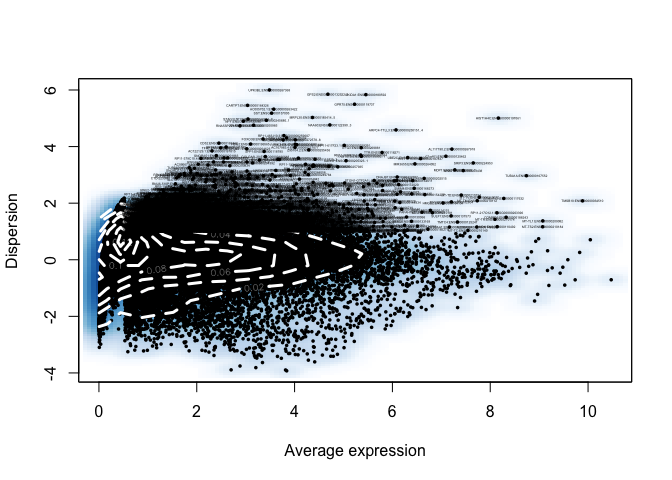
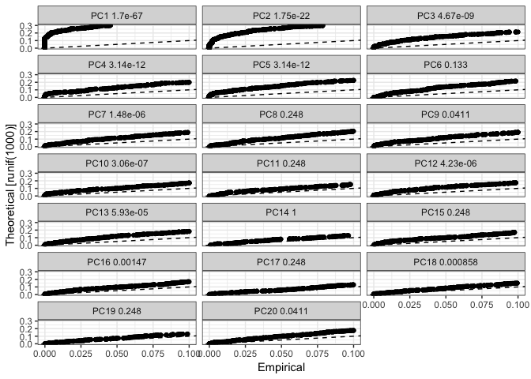
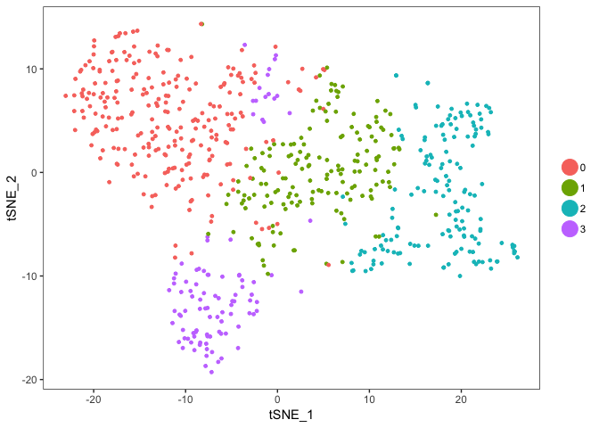
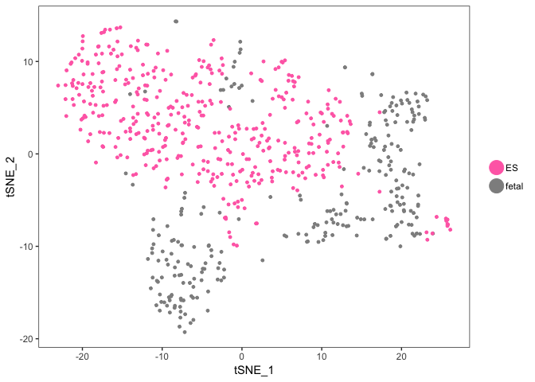
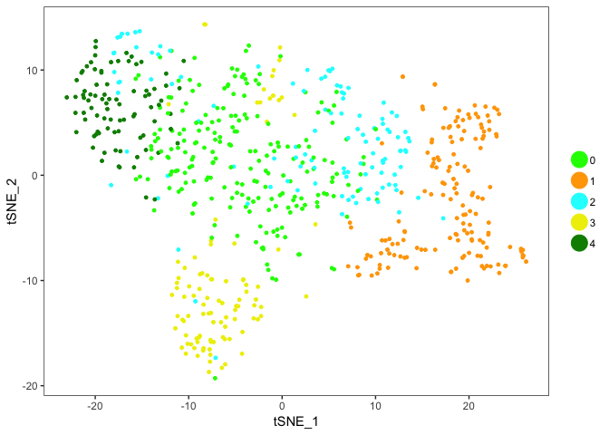

Rerun analysis of cells before grafting with CC-regression.

### Load packages

``` r
#suppressMessages(library(scater))
#suppressMessages(library(SC3))
suppressMessages(require(gridExtra))
suppressMessages(library(Seurat))
```

``` r
load("../data/seurat_object_before.Rdata")

meta <- dataSA@meta.data
meta$SeuratCluster <- meta$res.0.6
```

Create Seurat Object
--------------------

Create a new seurat object and normalize

``` r
dataSA <- CreateSeuratObject(raw.data = dataSA@raw.data, min.cells = 3, min.genes = 200, project = "before_grafting",is.expr=1,meta.data=meta)

scale.factor <- mean(colSums(dataSA@raw.data))
dataSA <- NormalizeData(object = dataSA, normalization.method = "LogNormalize", scale.factor = scale.factor)

# variable genes
dataSA <- FindVariableGenes(object = dataSA, mean.function = ExpMean, dispersion.function = LogVMR, x.low.cutoff = 1, x.high.cutoff = 10, y.cutoff = 1,cex.text.use=0.2)
```



``` r
length(x = dataSA@var.genes)
```

    ## [1] 2099

Cell cycle scoring
------------------

``` r
### cell cycle genes
data(cc.genes)


# obs! genes only have gene symbol, in matrix we have gene name + EnsID
rn <- rownames(dataSA@raw.data)
gname <- unlist(lapply(strsplit(rn,":"), function(x) x[1]))
cc.genes <- lapply(lapply(cc.genes, match, gname), function(x) na.omit(rn[x]))
# one gene has no translation, MLF1IP, in our annotation has name CENPU
cc.genes$s.genes <- c(cc.genes$s.genes, rn[grep("CENPU", rn)])


dataSA <- CellCycleScoring(dataSA, g2m.genes = cc.genes$g2m.genes,
                          s.genes = cc.genes$s.genes)

table(dataSA@meta.data$Phase)
```

    ## 
    ##  G1 G2M   S 
    ## 428 108 124

Cell cycle regression
---------------------

Regress out number of detected genes and cell cycle scores. Then run dim reduction and clustering.

``` r
dataSA <- ScaleData(object = dataSA, vars.to.regress = c("nGene","S.Score","G2M.Score"),display.progress=F)

#PCA
dataSA <- RunPCA(object = dataSA, pc.genes = dataSA@var.genes, do.print = FALSE)

#Determine statistically significant principal components
dataSA <- JackStraw(object = dataSA, num.replicate = 100, display.progress=FALSE)
JackStrawPlot(object = dataSA, PCs = 1:20)
```

    ## Warning: Removed 34053 rows containing missing values (geom_point).



    ## An object of class seurat in project before_grafting 
    ##  27474 genes across 660 samples.

``` r
use.pcs <- c(1,2,4,5,7,9,10,12,13)  
dataSA <- FindClusters(object = dataSA, reduction.type = "pca", dims.use = use.pcs, 
resolution = 0.6, print.output = 0, save.SNN = TRUE)


#tSNE
dataSA <- RunTSNE(object = dataSA, dims.use = use.pcs, do.fast = TRUE)
```

Plot
----

``` r
### tSNE plots
TSNEPlot(object = dataSA)
```



``` r
# by sample_type
TSNEPlot(object = dataSA, group.by = "sample_type", colors.use = c( "hotpink1","grey56"))
```



``` r
### Clusters without Cell Cycle regression
TSNEPlot(object = dataSA, group.by = "SeuratCluster", colors.use = c("green","orange","cyan","yellow2","green4"))
```



``` r
sessionInfo()
```

    ## R version 3.4.1 (2017-06-30)
    ## Platform: x86_64-apple-darwin14.5.0 (64-bit)
    ## Running under: macOS  10.15.2
    ## 
    ## Matrix products: default
    ## BLAS: /System/Library/Frameworks/Accelerate.framework/Versions/A/Frameworks/vecLib.framework/Versions/A/libBLAS.dylib
    ## LAPACK: /System/Library/Frameworks/Accelerate.framework/Versions/A/Frameworks/vecLib.framework/Versions/A/libLAPACK.dylib
    ## 
    ## locale:
    ## [1] en_US.UTF-8/en_US.UTF-8/en_US.UTF-8/C/en_US.UTF-8/en_US.UTF-8
    ## 
    ## attached base packages:
    ## [1] stats     graphics  grDevices utils     datasets  methods   base     
    ## 
    ## other attached packages:
    ## [1] Seurat_2.3.4  Matrix_1.2-14 cowplot_0.9.3 ggplot2_3.1.0 gridExtra_2.3
    ## 
    ## loaded via a namespace (and not attached):
    ##   [1] Rtsne_0.13          colorspace_1.3-2    class_7.3-14       
    ##   [4] modeltools_0.2-22   ggridges_0.5.0      mclust_5.4.1       
    ##   [7] rprojroot_1.3-2     htmlTable_1.12      base64enc_0.1-3    
    ##  [10] rstudioapi_0.7      proxy_0.4-22        npsurv_0.4-0       
    ##  [13] flexmix_2.3-14      bit64_0.9-7         mvtnorm_1.0-8      
    ##  [16] codetools_0.2-15    splines_3.4.1       R.methodsS3_1.7.1  
    ##  [19] lsei_1.2-0          robustbase_0.93-2   knitr_1.20         
    ##  [22] Formula_1.2-3       jsonlite_1.5        ica_1.0-1          
    ##  [25] cluster_2.0.7-1     kernlab_0.9-27      png_0.1-7          
    ##  [28] R.oo_1.22.0         compiler_3.4.1      httr_1.3.1         
    ##  [31] backports_1.1.2     assertthat_0.2.0    lazyeval_0.2.1     
    ##  [34] lars_1.2            acepack_1.4.1       htmltools_0.3.6    
    ##  [37] tools_3.4.1         bindrcpp_0.2.2      igraph_1.2.2       
    ##  [40] gtable_0.2.0        glue_1.3.0          RANN_2.6           
    ##  [43] reshape2_1.4.3      dplyr_0.7.6         Rcpp_1.0.0         
    ##  [46] trimcluster_0.1-2.1 gdata_2.18.0        ape_5.1            
    ##  [49] nlme_3.1-137        iterators_1.0.10    fpc_2.1-11.1       
    ##  [52] gbRd_0.4-11         lmtest_0.9-36       stringr_1.3.1      
    ##  [55] irlba_2.3.2         gtools_3.8.1        DEoptimR_1.0-8     
    ##  [58] MASS_7.3-50         zoo_1.8-3           scales_1.0.0       
    ##  [61] doSNOW_1.0.16       parallel_3.4.1      RColorBrewer_1.1-2 
    ##  [64] yaml_2.2.0          reticulate_1.10     pbapply_1.3-4      
    ##  [67] rpart_4.1-13        segmented_0.5-3.0   latticeExtra_0.6-28
    ##  [70] stringi_1.2.4       foreach_1.4.4       checkmate_1.8.5    
    ##  [73] caTools_1.17.1.1    bibtex_0.4.2        Rdpack_0.10-1      
    ##  [76] SDMTools_1.1-221    rlang_0.3.0.1       pkgconfig_2.0.2    
    ##  [79] dtw_1.18-1          prabclus_2.2-6      bitops_1.0-6       
    ##  [82] evaluate_0.11       lattice_0.20-35     ROCR_1.0-7         
    ##  [85] purrr_0.2.5         bindr_0.1.1         labeling_0.3       
    ##  [88] htmlwidgets_1.2     bit_1.1-12          tidyselect_0.2.4   
    ##  [91] plyr_1.8.4          magrittr_1.5        R6_2.2.2           
    ##  [94] snow_0.4-3          gplots_3.0.1        Hmisc_4.1-1        
    ##  [97] foreign_0.8-71      withr_2.1.2         fitdistrplus_1.0-11
    ## [100] mixtools_1.1.0      survival_2.42-6     nnet_7.3-12        
    ## [103] tsne_0.1-3          tibble_1.3.3        hdf5r_1.0.1        
    ## [106] KernSmooth_2.23-15  rmarkdown_1.10      grid_3.4.1         
    ## [109] data.table_1.11.4   metap_1.0           digest_0.6.18      
    ## [112] diptest_0.75-7      tidyr_0.8.1         R.utils_2.7.0      
    ## [115] stats4_3.4.1        munsell_0.5.0
