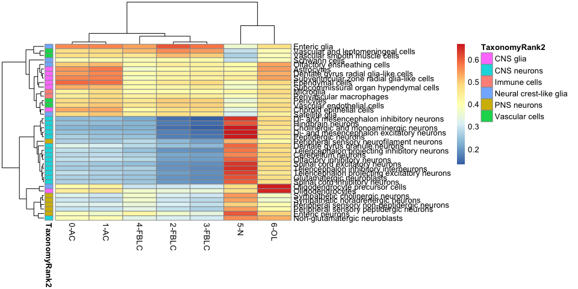
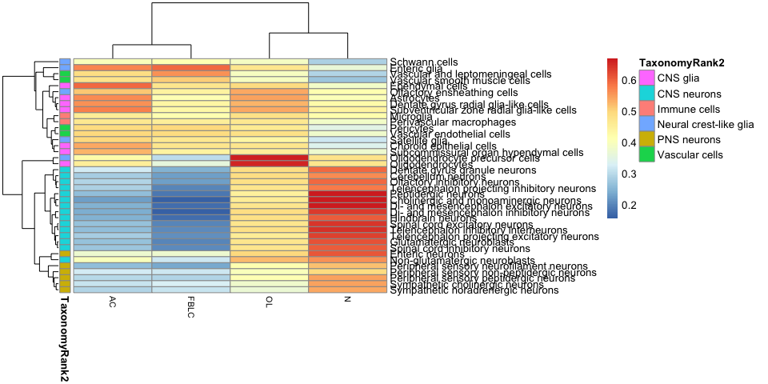
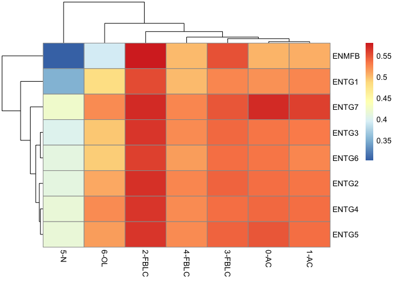
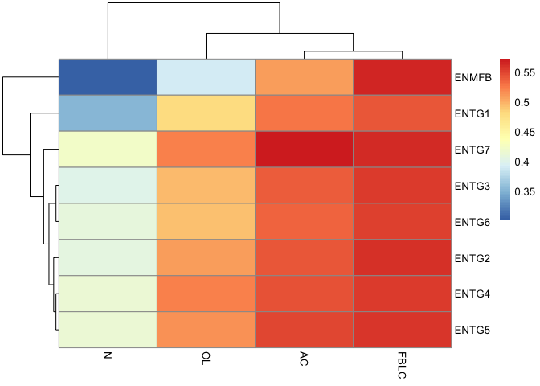

Using spearman correlations, compare the broad clusters in the linnarsson brain atlas to our celltypes.

Using both the merged cluster def and the initial cluster def from Seurat.

As a gene set, use only top marker genes for calculating correlations. Take top 100 from our SAMseq lists plus all marker genes from their list (consists of ~ 6 genes per cluster )

### Load packages

``` r
suppressMessages(library(Seurat))
suppressMessages(library(loomR))
suppressMessages(library(pheatmap))
```

### Read the loom files

Files in folder linnarsson\_atlas were downloaded from:

<http://mousebrain.org/downloads.html>.

``` r
# connect to loom file
lfile <- connect(filename = "../data/linnarsson_atlas/l5_all.agg.loom", mode = "r", skip.validate = T)
```

    ## Warning in .subset2(public_bind_env, "initialize")(...): Skipping
    ## validation step, some fields are not populated

``` r
# get expression matrix
exprs <- lfile[["matrix"]][,]
exprs <- t(exprs)

# get cluster names and gene naems
names <- lfile[["col_attrs"]]$names
clust <- lfile[["col_attrs/ClusterName"]][]
colnames(exprs) <- clust

gene.names <- lfile[["row_attrs/Gene"]][]
rownames(exprs) <- gene.names

# get all annotations into one matrix
M <- list()
for (n in names){
  M[[n]] <- lfile[["col_attrs"]][[n]][]
}
M <- Reduce(cbind,M)
rownames(M) <- clust
colnames(M) <- names
M <- data.frame(M)
```

Total of 265 clusteres, and 27998 genes.

-   ClusterName - refined cluster names - Level 6 clusters
-   TaxonomyRank1 - broad cell classes (Glia, Immune cells, Neurons, Vascular cells)
-   TaxonomyRank2 - more refined classes, 6 groups.
-   TaxonomyRank3 - more refined classes, 16 groups.
-   TaxonomyRank4 - more refined classes, 39 groups.
-   Region

### Extract all of their marker genes

``` r
markers <- unique(unlist(sapply(as.vector(M$MarkerGenes), strsplit, " ")))
length(markers)
```

    ## [1] 1237

### Read in our top marker genes.

``` r
types <- c("AC", "OL", "N", "FBLC")
SAM <- list()
for (t in types){
  SAM[[t]] <- read.table(sprintf("../data/samseq/samseq_%s_vs_restAfter.txt",t), header=T)
}
top.genes <- lapply(SAM, function(x) x[x$type == "down",]$Gene.ID[1:100])

markers2 <- unique(unlist(top.genes))
length(markers2)
```

    ## [1] 392

Read in the Seurat objects.
===========================

Take only our after clusters. Redefine the Seurat clusters into manually annotated groups.

``` r
savefile<-"../data/seurat_object_after.Rdata"
load(savefile)

clusterdef <- c("AC","AC","FBLC","FBLC","FBLC","N","OL")
names(clusterdef) <- as.character(0:6)
merged.clusters <- clusterdef[as.character(dataS@ident)]

names <- c("astrocytes","oligodendrocytes","neurons","FBLC")
shorterNames <- c("AC","OL","N","FBLC")
col=c("blue1","magenta","red1","green3")

RPKM <- dataS@raw.data
lr <- log2(RPKM+1)

clusters <- split(1:ncol(RPKM),merged.clusters)
clusters <- clusters[c(1,4,3,2)]

M.graft <- dataS@meta.data
M.graft$merged.clusters <- merged.clusters
```

Calculate mean expression across our clusters.

``` r
mean.clust <- Reduce(cbind,lapply(clusters, function(x) rowMeans(lr[,x])))
colnames(mean.clust) <- names(clusters)

seurat.clust <- split(1:ncol(RPKM),dataS@ident)

mean.seurat <- Reduce(cbind,lapply(seurat.clust, function(x) rowMeans(lr[,x])))
# rename with annotation as well.
colnames(mean.seurat) <- paste(names(seurat.clust), clusterdef, sep="-")
```

Translate human to mouse genes
------------------------------

``` r
transfile <- "../data/linnarsson_atlas/human_gene_translations.txt"
human.ensembl <- unlist(lapply(strsplit(rownames(RPKM), ":"), function(x) x[2]))
human.ensembl.fix <- gsub("\\.\\.\\d+","",human.ensembl)


if (file.exists(transfile)){
  gene.translation <- read.table(transfile)
}else{

  suppressMessages(library(biomaRt))
  # Load human ensembl attributes
  human = biomaRt::useMart("ensembl", dataset = "hsapiens_gene_ensembl")
  # Load mouse ensembl attributes
  mouse = biomaRt::useMart("ensembl", dataset = "mmusculus_gene_ensembl")

  # Link both datasets and retrieve human gene id + name
  gene.translation = biomaRt::getLDS(attributes = c("external_gene_name","ensembl_gene_id"), filters = "ensembl_gene_id", values = mouse.ensembl.fix , mart = human, attributesL = c("ensembl_gene_id","external_gene_name"), martL = mouse, uniqueRows = T)

  head(gene.translation)
  
  # only keep genes that also exists in the expression data
  gene.translation$merge.name <- paste(gene.translation$Gene.name, gene.translation$Gene.stable.ID, sep=":")

  matches1 <- sapply(gene.translation$merge.name, match, rownames(RPKM))
  matches2 <- sapply(gene.translation$Gene.name.1, match, rownames(exprs))
  keep <- (is.na(matches1) + is.na(matches2) )==0
  gene.translation <- gene.translation[keep,]
    
  write.table(gene.translation, file=transfile)
}

# select only genes that are among the marker genes
keep.markers1 <- which(gene.translation$Gene.name.1 %in% markers)
length(keep.markers1)
```

    ## [1] 929

``` r
keep.markers2 <- which(gene.translation$merge.name %in% markers2)
length(keep.markers2)
```

    ## [1] 325

``` r
keep.markers <- union(keep.markers1,keep.markers2)
length(keep.markers)
```

    ## [1] 1213

``` r
# make new expression matrices with these genes. One for Seurat clusters, one for merged clusters, one for linnarsson clusters. 
exprsA <- log2(exprs[match(gene.translation$Gene.name.1[keep.markers], rownames(exprs)),]+1)
exprsC <- mean.clust[match(gene.translation$merge.name[keep.markers], rownames(mean.clust)),]
exprsS <- mean.seurat[match(gene.translation$merge.name[keep.markers], rownames(mean.seurat)),]
```

### Mean expression at Taxonomy Rank 4

Take MBA data at Tax rank 4 and compute mean expression.

``` r
level4 <- split(1:ncol(exprsA), M$TaxonomyRank4)
get.mean <- function(x){
  if (length(x) == 1) { return(exprsA[,x])}
  else { return(rowMeans(exprsA[,x]))}
}
mean.level4 <- lapply(level4, get.mean)
exprs4 <- Reduce(cbind, mean.level4)
colnames(exprs4) <- names(level4)

#make color def for Tax rank2 
tax2 <- as.character(M[match(names(level4), M$TaxonomyRank4),]$TaxonomyRank2)
colorsC <- data.frame(TaxonomyRank2 =  tax2)
rownames(colorsC) <- names(level4)
```

Calculate correlation
=====================

And plot as a heatmap.

``` r
# correlation to seurat clusters
c4S <- cor(exprsS,exprs4, method = "spearman")
pheatmap(t(c4S), fotsize_col = 8, annotation_row = colorsC)
```



``` r
# correlation to merged clusters
c4C <- cor(exprsC,exprs4, method = "spearman")
pheatmap(t(c4C), fontsize_col = 8, annotation_row = colorsC)
```



Make pdfs with the same plots.

``` r
pdf("../data/linnarsson_atlas/heatmaps_level4_vs_clust_atlas_markers.pdf")
pheatmap(t(c4S), fotsize_col = 8, cluster_cols = F, annotation_row = colorsC)
pheatmap(t(c4C), fontsize_col = 8, cluster_cols = F, annotation_row = colorsC)
dev.off()
```

    ## quartz_off_screen 
    ##                 2

Make a plot with only the Enteric glia subclusters
==================================================

``` r
enteric <- grep("Enteric glia", M$TaxonomyRank4)
cES <- cor(exprsS,exprsA[,enteric], method = "spearman")
pheatmap(t(cES))
```



``` r
cEC <- cor(exprsC,exprsA[,enteric], method = "spearman")
pheatmap(t(cEC))
```



``` r
# print correlations to FBLCs
print(cEC["FBLC",])
```

    ##     ENTG1     ENTG4     ENTG2     ENTG3     ENTG6     ENTG5     ENTG7 
    ## 0.5404113 0.5541160 0.5595527 0.5559281 0.5508355 0.5564586 0.5639202 
    ##     ENMFB 
    ## 0.5648718

``` r
print(cES[grep("FBLC",rownames(cES)),])
```

    ##            ENTG1     ENTG4     ENTG2     ENTG3     ENTG6     ENTG5
    ## 2-FBLC 0.5517734 0.5625335 0.5664352 0.5644330 0.5593384 0.5640848
    ## 3-FBLC 0.5243871 0.5362184 0.5401666 0.5392165 0.5362234 0.5411557
    ## 4-FBLC 0.4997027 0.5214188 0.5261822 0.5208444 0.5131412 0.5215098
    ##            ENTG7     ENMFB
    ## 2-FBLC 0.5706758 0.5790444
    ## 3-FBLC 0.5478417 0.5510687
    ## 4-FBLC 0.5249896 0.4986077

The whole FBLC cluster have highest similarity to ENMFB (Enteric mesothelial fibroblasts).

Subclusters 2 & 3 also have highest similarity to ENMFB, while cluster 4 has highest similarity to ENTG2.

``` r
sessionInfo()
```

    ## R version 3.4.1 (2017-06-30)
    ## Platform: x86_64-apple-darwin15.6.0 (64-bit)
    ## Running under: macOS Sierra 10.12.6
    ## 
    ## Matrix products: default
    ## BLAS: /Library/Frameworks/R.framework/Versions/3.4/Resources/lib/libRblas.0.dylib
    ## LAPACK: /Library/Frameworks/R.framework/Versions/3.4/Resources/lib/libRlapack.dylib
    ## 
    ## locale:
    ## [1] en_US.UTF-8/en_US.UTF-8/en_US.UTF-8/C/en_US.UTF-8/en_US.UTF-8
    ## 
    ## attached base packages:
    ## [1] stats     graphics  grDevices utils     datasets  methods   base     
    ## 
    ## other attached packages:
    ##  [1] pheatmap_1.0.8   loomR_0.2.0      itertools_0.1-3  iterators_1.0.10
    ##  [5] hdf5r_1.0.0      R6_2.2.2         Seurat_2.3.4     Matrix_1.2-14   
    ##  [9] cowplot_0.9.2    ggplot2_2.2.1   
    ## 
    ## loaded via a namespace (and not attached):
    ##   [1] Rtsne_0.13          colorspace_1.3-2    class_7.3-14       
    ##   [4] modeltools_0.2-21   ggridges_0.4.1      mclust_5.4         
    ##   [7] rprojroot_1.3-2     htmlTable_1.11.2    base64enc_0.1-3    
    ##  [10] rstudioapi_0.7      proxy_0.4-21        flexmix_2.3-14     
    ##  [13] bit64_0.9-7         mvtnorm_1.0-7       codetools_0.2-15   
    ##  [16] splines_3.4.1       R.methodsS3_1.7.1   robustbase_0.92-8  
    ##  [19] knitr_1.19          Formula_1.2-2       jsonlite_1.5       
    ##  [22] ica_1.0-1           cluster_2.0.6       kernlab_0.9-25     
    ##  [25] png_0.1-7           R.oo_1.21.0         compiler_3.4.1     
    ##  [28] httr_1.3.1          backports_1.1.2     assertthat_0.2.0   
    ##  [31] lazyeval_0.2.1      lars_1.2            acepack_1.4.1      
    ##  [34] htmltools_0.3.6     tools_3.4.1         bindrcpp_0.2       
    ##  [37] igraph_1.1.2        gtable_0.2.0        glue_1.3.0         
    ##  [40] RANN_2.5.1          reshape2_1.4.3      dplyr_0.7.4        
    ##  [43] Rcpp_0.12.15        trimcluster_0.1-2   gdata_2.18.0       
    ##  [46] ape_5.0             nlme_3.1-131        fpc_2.1-11         
    ##  [49] gbRd_0.4-11         lmtest_0.9-35       stringr_1.3.1      
    ##  [52] irlba_2.3.2         gtools_3.5.0        DEoptimR_1.0-8     
    ##  [55] MASS_7.3-48         zoo_1.8-1           scales_0.5.0       
    ##  [58] doSNOW_1.0.16       parallel_3.4.1      RColorBrewer_1.1-2 
    ##  [61] yaml_2.1.16         reticulate_1.10     pbapply_1.3-4      
    ##  [64] gridExtra_2.3       rpart_4.1-12        segmented_0.5-3.0  
    ##  [67] latticeExtra_0.6-28 stringi_1.2.4       foreach_1.4.4      
    ##  [70] checkmate_1.8.5     caTools_1.17.1      bibtex_0.4.2       
    ##  [73] Rdpack_0.9-0        SDMTools_1.1-221    rlang_0.2.0        
    ##  [76] pkgconfig_2.0.1     dtw_1.18-1          prabclus_2.2-6     
    ##  [79] bitops_1.0-6        evaluate_0.10.1     lattice_0.20-35    
    ##  [82] ROCR_1.0-7          purrr_0.2.4         bindr_0.1          
    ##  [85] htmlwidgets_1.0     bit_1.1-12          plyr_1.8.4         
    ##  [88] magrittr_1.5        snow_0.4-2          gplots_3.0.1       
    ##  [91] Hmisc_4.1-1         pillar_1.1.0        foreign_0.8-69     
    ##  [94] fitdistrplus_1.0-9  mixtools_1.1.0      survival_2.41-3    
    ##  [97] nnet_7.3-12         tibble_1.4.2        tsne_0.1-3         
    ## [100] KernSmooth_2.23-15  rmarkdown_1.8       grid_3.4.1         
    ## [103] data.table_1.10.4-3 metap_1.0           digest_0.6.15      
    ## [106] diptest_0.75-7      tidyr_0.8.0         R.utils_2.6.0      
    ## [109] stats4_3.4.1        munsell_0.4.3
