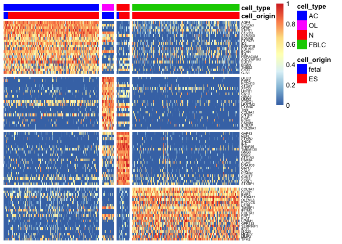
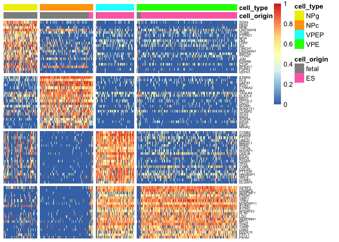

Plot gene expression for selected genes as violins, heatmaps and onto tSNEs.

After grafting genes: /proj/uppstore2017201/b2014109/private/analysis\_KT/transplants/seurat\_barplot/gene\_list\_fig2\_barplot\_final.csv

Before grafting genes: /proj/uppstore2017201/b2014109/private/analysis\_KT/transplants/seurat\_barplot/gene\_list\_fig4\_barplot\_2.csv

### Load packages

``` r
suppressMessages(library(Seurat))
suppressMessages(library(sm))
suppressMessages(library(pheatmap))
source("vioplot.list.R")
```

Violin plots
============

### Start with the After genes.

``` r
savefile<-"../data/seurat_object_after.Rdata"
load(savefile)

clusterdef <- c("AC","AC","FBLC","FBLC","FBLC","N","OL")
names(clusterdef) <- as.character(0:6)
merged.clustersA <- clusterdef[as.character(dataS@ident)]

names <- c("astrocytes","oligodendrocytes","neurons","FBLC")
shorterNames <- c("AC","OL","N","FBLC")
col=c("blue1","magenta","red1","green3")

RPKM <- dataS@raw.data
lrA <- log2(RPKM+1)

genes <- read.table("../data/gene_plots/gene_list_fig2_barplot_final.csv", header = T)
genes <- as.character(genes[,1])

# make a list with cluster def
clusters <- split(1:ncol(RPKM),merged.clustersA)
clusters <- clusters[c(1,4,3,2)] # reorder for plotting
```

Define plotting function

``` r
plot.genes <- function(gene,exp,clusts, colordef, small = TRUE) {
        # if gene is not in dataset.
        if (!gene %in% rownames(exp)){
          plot.new()
          return(0)
        }

        e <- exp[gene,]
        l <- lapply(clusts, function(x) e[x])
        # if the gene is not expressed in a cluster
        lz<- which(unlist(lapply(l,sum))==0)
        for (z in lz)  { l[[z]]<-rnorm(length(l[[z]]),mean=0,sd=1e-30) }
        ylim <- NULL
        if (length(lz) == length(clusts)) { ylim <- c(0,8)}
        if (small) {
          vioplot.list.small(l,col=colordef, ylim = ylim, border = NA, drawRect = F)
        }else {
          vioplot.list(l,col=colordef)
        }
        n <- unlist(strsplit(gene, ":"))[1]
        mtext(n, cex=0.7)
}
```

Plot to a pdf

``` r
pdf("../data/gene_plots/vioplots_after.pdf")

par(mfrow=c(6,4),mar=c(5,1,2,1),cex=0.4)
for (gene in genes){
  plot.genes(gene,lrA,clusters,col, small = T)
}

dev.off()
```

    ## quartz_off_screen 
    ##                 2

### Same for the before genes.

``` r
savefile<-"../data/seurat_object_before.Rdata"
load(savefile)
names <- c("NPg","NPc","VPEP","VPE")

clusterdef <- c("VPE","NPc","VPEP","NPg","VPE")
names(clusterdef) <- as.character(0:4)
merged.clustersB <- clusterdef[as.character(dataSA@ident)]
col <- c("yellow", "orange","cyan", "green")


RPKM <- dataSA@raw.data
lrB <- log2(RPKM+1)

genes <- read.table("../data/gene_plots/gene_list_fig4_barplot_2.csv", header = T)
genes <- as.character(genes[,1])

clusters <- split(1:ncol(RPKM),merged.clustersB)
clusters <- clusters[c(2,1,4,3)]
```

``` r
pdf("../data/gene_plots/vioplots_before.pdf")

par(mfrow=c(6,4),mar=c(5,1,2,1),cex=0.4)
for (gene in genes){
  plot.genes(as.character(gene),lrB,clusters,col, small = T)
}

dev.off()
```

    ## quartz_off_screen 
    ##                 2

Heatmaps with selected genes
============================

Heatmap with 20 DE genes per cluster, cells after grafting.

``` r
gene.tableA <- read.table("../data/gene_plots/gene_list_heatmap_20genesGroup_SupFig2_TransplantAfter.csv",sep=";",header=T)


# reorder cells for plotting
sets.cell <- split(colnames(lrA),merged.clustersA)
sets.cell2 <- sets.cell[c("AC","OL","N","FBLC")]
ordered <- unlist(sets.cell2)
o <- match(ordered, colnames(lrA))

# reorder the matrix
lr <- lrA[match(gene.tableA$Gene,rownames(lrA)),match(ordered, colnames(lrA))]

# remove ensembl name 
rownames(lr) <- unlist(lapply(strsplit(rownames(lr), ":"), function(x) x[1]))

# define coloring
cell.origin <- dataS@meta.data$sample_type
cell.cluster <- merged.clustersA

colorsC <- data.frame(cell_origin = cell.origin,cell_type = cell.cluster)
rownames(colorsC) <- colnames(lrA)

#define gaps in plot
gapsR <- which(!duplicated(gene.tableA$Group))[-1]-1
gapsC <- which(!duplicated(merged.clustersA[o]))[-1]-1

# color legends
clustertype <- names(sets.cell2)
coldef.clustertype<- c("blue1", "magenta","red","green3")
names(coldef.clustertype) <- clustertype


celltypes <- unique(cell.origin)
coldef.celltypes <- c("blue","red")
names(coldef.celltypes) <- celltypes

ann_colors = list(
    cell_type = coldef.clustertype,
    cell_origin = coldef.celltypes
)

lr.scale <- t(apply(lr,1,function(x) x/max(x)))

pheatmap(lr.scale, annotation_col = colorsC,  cluster_rows=F,cluster_cols=F, show_colnames=F,gaps_col=gapsC, gaps_row=gapsR, annotation_colors = ann_colors, fontsize_row = 5)
```



``` r
# print to pdf
pdf("../data/gene_plots/heatmap_after_genes.pdf")
pheatmap(lr.scale, annotation_col = colorsC,  cluster_rows=F,cluster_cols=F, show_colnames=F,gaps_col=gapsC, gaps_row=gapsR, annotation_colors = ann_colors, fontsize_row = 5)
dev.off()
```

    ## quartz_off_screen 
    ##                 2

Heatmap with 20 DE genes per cluster, cells before grafting.

``` r
gene.tableB <- read.table("../data/gene_plots/gene_list_heatmap_20genesGroup_SupFig4_TransplantBefore.csv",sep=";",header=T)


# reorder cells for plotting
sets.cell <- split(colnames(lrB),merged.clustersB)
sets.cell2 <- sets.cell[c("NPg","NPc","VPEP","VPE")]
ordered <- unlist(sets.cell2)
o <- match(ordered, colnames(lrB))

# reorder the matrix
lr <- lrB[match(gene.tableB$Gene,rownames(lrB)),match(ordered, colnames(lrB))]

# remove ensembl name 
rownames(lr) <- unlist(lapply(strsplit(rownames(lr), ":"), function(x) x[1]))

# define coloring
cell.origin <- dataSA@meta.data$sample_type
cell.cluster <- merged.clustersB

colorsC <- data.frame(cell_origin = cell.origin,cell_type = cell.cluster)
rownames(colorsC) <- colnames(lrB)

#define gaps in plot
gapsR <- which(!duplicated(gene.tableB$Group))[-1]-1
gapsC <- which(!duplicated(merged.clustersB[o]))[-1]-1

# color legends
clustertype <- names(sets.cell2)
coldef.clustertype<- c("yellow2", "orange","cyan","green")
names(coldef.clustertype) <- clustertype


celltypes <- unique(cell.origin)
coldef.celltypes <- c("grey56","hotpink1")
names(coldef.celltypes) <- celltypes

ann_colors = list(
    cell_type = coldef.clustertype,
    cell_origin = coldef.celltypes
)

lr.scale <- t(apply(lr,1,function(x) x/max(x)))

pheatmap(lr.scale, annotation_col = colorsC,  cluster_rows=F,cluster_cols=F, show_colnames=F,gaps_col=gapsC, gaps_row=gapsR, annotation_colors = ann_colors, fontsize_row = 5)
```



``` r
# print to pdf
pdf("../data/gene_plots/heatmap_before_genes.pdf")
pheatmap(lr.scale, annotation_col = colorsC,  cluster_rows=F,cluster_cols=F, show_colnames=F,gaps_col=gapsC, gaps_row=gapsR, annotation_colors = ann_colors, fontsize_row = 5)
dev.off()
```

    ## quartz_off_screen 
    ##                 2

tSNE plots visualizing expression of selected genes
===================================================

Function for plotting.

``` r
cc<-colorRampPalette(c("green","yellow","red"))
rpkm.color <- function(x,colscale,col.range=NULL){
        x.range<-range(na.omit(x))
        by=0.1
        if (is.null(col.range)){
                by=1
                if (x.range[2]-x.range[1] <10){ by =0.01 }
                col.range<-seq(x.range[1],x.range[2],by=by)
        }
        col.def<-colscale(length(col.range))
        col.idx<-round((x-x.range[1])/by)+1
        col.idx[col.idx>length(col.range)]<-length(col.range)
        cols<-col.def[col.idx]
        return(cols)
}
```

Read in full expression matrix.

``` r
R <-read.table("../data/ensembl_rpkms_filtered.csv", sep=",", header=T)
M <- read.table("../data/metadata_all_filtered.csv", sep=",",header=T)

after <- grep("after",M$plate)
before <- grep("before",M$plate)

lrB <- as.matrix(log2(R[,before]+1))
lrA <- as.matrix(log2(R[,after]+1))
```

``` r
figure4_relatedGenes<-c("NES:ENSG00000132688","SOX2:ENSG00000181449","SOX9:ENSG00000125398","PROM1:ENSG00000007062","RFX4:ENSG00000111783","NOTCH1:ENSG00000148400","NOTCH2:ENSG00000134250","HEY1:ENSG00000164683","JAG1:ENSG00000101384","DCX:ENSG00000077279","NCAM1:ENSG00000149294","SYT1:ENSG00000067715","STMN2:ENSG00000104435","GAP43:ENSG00000172020","TH:ENSG00000180176","DDC:ENSG00000132437","PBX1:ENSG00000185630..1","PBX1:ENSG00000185630..2","NEUROG2:ENSG00000178403","ASCL1:ENSG00000139352","HES1:ENSG00000114315","HES5:ENSG00000197921","LMX1A:ENSG00000162761","FOXA2:ENSG00000125798","NR4A2:ENSG00000153234","PITX3:ENSG00000107859","EN1:ENSG00000163064","CCNB2:ENSG00000157456","AURKB:ENSG00000178999","PTTG1:ENSG00000164611","TOP2A:ENSG00000131747","COL3A1:ENSG00000168542","FBLN1:ENSG00000077942","EMP2:ENSG00000213853","S100A11:ENSG00000163191","IFITM2:ENSG00000185201","COL1A1:ENSG00000108821","PCOLCE:ENSG00000106333","CPXM1:ENSG00000088882","MMP2:ENSG00000087245","SERPINF1:ENSG00000132386","MFAP2:ENSG00000117122","TPM2:ENSG00000198467","POU5F1:ENSG00000204531","NANOG:ENSG00000111704","T:ENSG00000164458","SOX17:ENSG00000164736","DLK1:ENSG00000185559","OTX2:ENSG00000165588")

tsneB <- dataSA@dr$tsne@cell.embeddings

pdf("../data/gene_plots/tsne_before.pdf")
par(mfrow=c(3,3),mar=c(3,3,2,1))
for (gn in figure4_relatedGenes) {
    m<-match(gn,rownames(lrB))
    maxR<-ceiling(max(lrB[m,]))
    col.range <- seq(0,maxR,by=0.1)
    col <- rpkm.color(lrB[m,],cc,col.range)
    plot(tsneB, col= col, pch=16, cex=0.4,main=gn,axes=FALSE, ylab="",xlab="")
}
dev.off()
```

    ## quartz_off_screen 
    ##                 2

``` r
ExtFigure2_relatedGenes<-c("AQP4:ENSG00000171885","SLC1A3:ENSG00000079215","GFAP:ENSG00000131095","GJA1:ENSG00000152661","EDNRB:ENSG00000136160","SLC4A4:ENSG00000080493","LRRC3B:ENSG00000179796","FBXO2:ENSG00000116661","OLIG1:ENSG00000184221","OLIG2:ENSG00000205927","PCDH15:ENSG00000150275","PMP2:ENSG00000147588","NKX2-2:ENSG00000125820","SOX10:ENSG00000100146","PDGFRA:ENSG00000134853..1","PDGFRA:ENSG00000134853..2","PLP1:ENSG00000123560","GAP43:ENSG00000172020","RBFOX3:ENSG00000167281","NSG2:ENSG00000170091","SNAP25:ENSG00000132639","NEFL:ENSG00000104725","SYN1:ENSG00000008056","TH:ENSG00000180176","NR4A2:ENSG00000153234","SLC18A2:ENSG00000165646","DDC:ENSG00000132437","RET:ENSG00000165731","GFRA1:ENSG00000151892","FOXA2:ENSG00000125798","PDGFRA:ENSG00000134853..1","PDGFRA:ENSG00000134853..2","COL1A1:ENSG00000108821","COL1A2:ENSG00000164692","LUM:ENSG00000139329","DCN:ENSG00000011465","FBLN1:ENSG00000077942")

tsneA <- dataS@dr$tsne@cell.embeddings

pdf("../data/gene_plots/tsne_after.pdf")
par(mfrow=c(3,3),mar=c(3,3,2,1))
for (gn in ExtFigure2_relatedGenes) {
    m<-match(gn,rownames(lrA))
    maxR<-ceiling(max(lrA[m,]))
    col.range <- seq(0,maxR,by=0.1)
    col <- rpkm.color(lrA[m,],cc,col.range)
    plot(tsneA, col= col, pch=16, cex=0.4,main=gn,axes=FALSE, ylab="",xlab="")
}
dev.off()
```

    ## quartz_off_screen 
    ##                 2

``` r
sessionInfo()
```

    ## R version 3.4.1 (2017-06-30)
    ## Platform: x86_64-apple-darwin15.6.0 (64-bit)
    ## Running under: macOS Sierra 10.12.6
    ## 
    ## Matrix products: default
    ## BLAS: /Library/Frameworks/R.framework/Versions/3.4/Resources/lib/libRblas.0.dylib
    ## LAPACK: /Library/Frameworks/R.framework/Versions/3.4/Resources/lib/libRlapack.dylib
    ## 
    ## locale:
    ## [1] en_US.UTF-8/en_US.UTF-8/en_US.UTF-8/C/en_US.UTF-8/en_US.UTF-8
    ## 
    ## attached base packages:
    ## [1] stats     graphics  grDevices utils     datasets  methods   base     
    ## 
    ## other attached packages:
    ## [1] pheatmap_1.0.8 sm_2.2-5.4     Seurat_2.3.4   Matrix_1.2-14 
    ## [5] cowplot_0.9.2  ggplot2_2.2.1 
    ## 
    ## loaded via a namespace (and not attached):
    ##   [1] tsne_0.1-3          segmented_0.5-3.0   nlme_3.1-131       
    ##   [4] bitops_1.0-6        bit64_0.9-7         httr_1.3.1         
    ##   [7] RColorBrewer_1.1-2  rprojroot_1.3-2     prabclus_2.2-6     
    ##  [10] tools_3.4.1         backports_1.1.2     irlba_2.3.2        
    ##  [13] R6_2.2.2            rpart_4.1-12        KernSmooth_2.23-15 
    ##  [16] Hmisc_4.1-1         lazyeval_0.2.1      colorspace_1.3-2   
    ##  [19] trimcluster_0.1-2   nnet_7.3-12         gridExtra_2.3      
    ##  [22] bit_1.1-12          compiler_3.4.1      htmlTable_1.11.2   
    ##  [25] hdf5r_1.0.0         diptest_0.75-7      caTools_1.17.1     
    ##  [28] scales_0.5.0        checkmate_1.8.5     lmtest_0.9-35      
    ##  [31] DEoptimR_1.0-8      mvtnorm_1.0-7       robustbase_0.92-8  
    ##  [34] ggridges_0.4.1      pbapply_1.3-4       dtw_1.18-1         
    ##  [37] proxy_0.4-21        stringr_1.3.1       digest_0.6.15      
    ##  [40] mixtools_1.1.0      foreign_0.8-69      rmarkdown_1.8      
    ##  [43] R.utils_2.6.0       base64enc_0.1-3     pkgconfig_2.0.1    
    ##  [46] htmltools_0.3.6     bibtex_0.4.2        htmlwidgets_1.0    
    ##  [49] rlang_0.2.0         rstudioapi_0.7      bindr_0.1          
    ##  [52] jsonlite_1.5        zoo_1.8-1           ica_1.0-1          
    ##  [55] mclust_5.4          gtools_3.5.0        acepack_1.4.1      
    ##  [58] dplyr_0.7.4         R.oo_1.21.0         magrittr_1.5       
    ##  [61] modeltools_0.2-21   Formula_1.2-2       lars_1.2           
    ##  [64] Rcpp_0.12.15        munsell_0.4.3       reticulate_1.10    
    ##  [67] ape_5.0             R.methodsS3_1.7.1   stringi_1.2.4      
    ##  [70] yaml_2.1.16         gbRd_0.4-11         MASS_7.3-48        
    ##  [73] flexmix_2.3-14      gplots_3.0.1        Rtsne_0.13         
    ##  [76] plyr_1.8.4          grid_3.4.1          parallel_3.4.1     
    ##  [79] gdata_2.18.0        doSNOW_1.0.16       lattice_0.20-35    
    ##  [82] splines_3.4.1       SDMTools_1.1-221    knitr_1.19         
    ##  [85] pillar_1.1.0        igraph_1.1.2        fpc_2.1-11         
    ##  [88] reshape2_1.4.3      codetools_0.2-15    stats4_3.4.1       
    ##  [91] glue_1.3.0          evaluate_0.10.1     metap_1.0          
    ##  [94] latticeExtra_0.6-28 data.table_1.10.4-3 png_0.1-7          
    ##  [97] Rdpack_0.9-0        foreach_1.4.4       purrr_0.2.4        
    ## [100] tidyr_0.8.0         gtable_0.2.0        RANN_2.5.1         
    ## [103] kernlab_0.9-25      assertthat_0.2.0    class_7.3-14       
    ## [106] survival_2.41-3     tibble_1.4.2        snow_0.4-2         
    ## [109] iterators_1.0.10    bindrcpp_0.2        cluster_2.0.6      
    ## [112] fitdistrplus_1.0-9  ROCR_1.0-7
