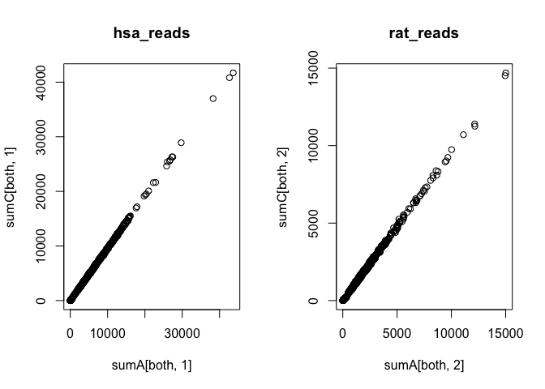
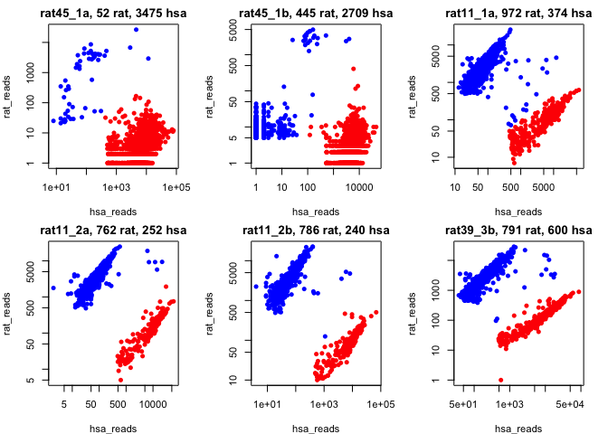
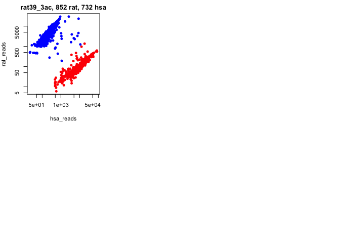
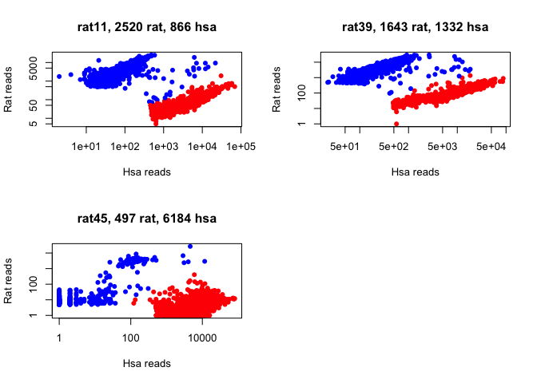

``` r
library(Matrix)
```

Read all data
-------------

Read in the matrix and calculate number of hsa and rat UMIs.

``` r
dirs <- c("../data/DataFiles/Mspecies_FACS/","../data/DataFiles/Mspecies_NotFACS/")

alldata <- list()
for (d in dirs){
  samples <- dir(d, pattern = "rat*")
  for (s in samples){
    features <- read.table(gzfile(paste(d,s,"/outs/filtered_feature_bc_matrix/features.tsv.gz", sep='')), header=F)
    barcodes <- read.table(gzfile(paste(d,s,"/outs/filtered_feature_bc_matrix/barcodes.tsv.gz", sep='')), header=F)
    m <- readMM(gzfile(paste(d,s,"/outs/filtered_feature_bc_matrix/matrix.mtx.gz", sep='')))
    rat <- grep("Rnor6", features[,1])
    hsa <- grep("GRCH38", features[,1])
    hsa_reads <- colSums(m[hsa,])
    rat_reads <- colSums(m[rat,])
    sum <- cbind(hsa_reads,rat_reads)
    rownames(sum) <- barcodes[,1]
    alldata[[s]] <- sum
  }
}

# check number of cells per run
unlist(lapply(alldata,nrow))
```

    ## rat45_1a rat45_1b rat11_1a rat11_2a rat11_2b rat39_3a rat39_3b rat39_3c 
    ##     3527     3154     1346     1014     1026     1577     1391     1566

Merge reads from the 2 runs for rat39

``` r
ra <- "rat39_3a"
rc <- "rat39_3c"

sumA <- alldata[[ra]]
sumC <- alldata[[rc]]

m <- match(rownames(sumA),rownames(sumC))
both <- intersect(rownames(sumA),rownames(sumC))

print(sprintf("Both: %d",length(both)))
```

    ## [1] "Both: 1559"

``` r
print(sprintf("39_3a: %d",nrow(sumA)))
```

    ## [1] "39_3a: 1577"

``` r
print(sprintf("39_3c: %d",nrow(sumC)))
```

    ## [1] "39_3c: 1566"

``` r
#check if similar values for the overlapping indices
par(mfrow=c(1,2))
plot(sumA[both,1], sumC[both,1], main="hsa_reads")
plot(sumA[both,2], sumC[both,2], main="rat_reads")
```



``` r
# add together
sumBoth <- sumA[both,] + sumC[both,]
# add the unique barcodes 
uniqueA <- setdiff(rownames(sumA),both)
sumBoth <- rbind(sumBoth, sumA[uniqueA,])

uniqueC <- setdiff(rownames(sumC),both)
sumBoth <- rbind(sumBoth, sumC[uniqueC,])

alldata[["rat39_3ac"]] <- sumBoth

# remove the 2 individual samples
alldata$rat39_3a <- NULL
alldata$rat39_3c <- NULL
unlist(lapply(alldata,nrow))
```

    ##  rat45_1a  rat45_1b  rat11_1a  rat11_2a  rat11_2b  rat39_3b rat39_3ac 
    ##      3527      3154      1346      1014      1026      1391      1584

Plot the distribution
---------------------

Color cells by red \< 10% rat reads, blue \> 10% rat reads

``` r
cutoff <- 0.10

par(mfrow=c(2,3), mar = c(4,4,2,2), cex=0.7)
for(sample in names(alldata)){
  d <- alldata[[sample]]
  ratio <- d[,2]/rowSums(d)
  filt <- which(ratio >= cutoff)
  col <- rep("red",nrow(d))
  col[filt]<-"blue"
  plot(d+1,col=col, pch=16,log='xy', main=sprintf("%s, %d rat, %d hsa",sample, length(filt), nrow(d)-length(filt)))
}
```



With cutoff 0.2 many cells in the middle are kept, to be on the safe
side, set cutoff to 0.1 instead, to be certain not to have a mouse cell
sticking to it.

Make a table per sample with the ratio rat reads stored and write to
file what cells to keep, and write to a file

``` r
for(sample in names(alldata)){
  d <- alldata[[sample]]
  ratio <- d[,2]/rowSums(d)
  filt <- which(ratio >= cutoff)
  d <- cbind(d,ratio)
  d <- d[-filt,]
  write.table(d, file = sprintf("../data/processed2/rat_filtering_%s.csv", sample), sep=",", quote=F)
}
```

Plot stats merged per rat
-------------------------

``` r
rats <- unlist(lapply(strsplit(names(alldata),"_"), function(x) x[1]))
rat2sample <- split(names(alldata),rats)

par(mfrow=c(2,2))
for (rat in names(rat2sample)){
  d <- Reduce(rbind, alldata[rat2sample[[rat]]])
  ratio <- d[,2]/rowSums(d)
  filt <- which(ratio >= cutoff)
  col <- rep("red",nrow(d))
  col[filt]<-"blue"
  plot(d+1,col=col, pch=16,log='xy', main=sprintf("%s, %d rat, %d hsa",rat, length(filt), nrow(d)-length(filt)), ylab="Rat reads", xlab="Hsa reads")
}
```



Plot the same to pdf

``` r
pdf("../data/figures2/rat_hsa_filtering.pdf")
par(mfrow=c(2,2))
for (rat in names(rat2sample)){
  d <- Reduce(rbind, alldata[rat2sample[[rat]]])
  ratio <- d[,2]/rowSums(d)
  filt <- which(ratio >= cutoff)
  col <- rep("red",nrow(d))
  col[filt]<-"blue"
  plot(d+1,col=col, pch=16,log='xy', main=sprintf("%s, %d rat, %d hsa",rat, length(filt), nrow(d)-length(filt)), ylab="Rat reads", xlab="Hsa reads")
}
dev.off()
```

    ## quartz_off_screen 
    ##                 2

Session info:

``` r
sessionInfo()
```

    ## R version 3.5.1 (2018-07-02)
    ## Platform: x86_64-apple-darwin13.4.0 (64-bit)
    ## Running under: macOS  10.15.2
    ## 
    ## Matrix products: default
    ## BLAS/LAPACK: /Users/asbj/miniconda3/envs/seurat3/lib/R/lib/libRblas.dylib
    ## 
    ## locale:
    ## [1] en_US.UTF-8/en_US.UTF-8/en_US.UTF-8/C/en_US.UTF-8/en_US.UTF-8
    ## 
    ## attached base packages:
    ## [1] stats     graphics  grDevices utils     datasets  methods   base     
    ## 
    ## other attached packages:
    ## [1] Matrix_1.2-17
    ## 
    ## loaded via a namespace (and not attached):
    ##  [1] Rcpp_1.0.2      lattice_0.20-38 digest_0.6.22   rprojroot_1.3-2
    ##  [5] grid_3.5.1      backports_1.1.5 magrittr_1.5    evaluate_0.14  
    ##  [9] rlang_0.4.1     stringi_1.4.3   rmarkdown_1.10  tools_3.5.1    
    ## [13] stringr_1.4.0   yaml_2.2.0      compiler_3.5.1  htmltools_0.4.0
    ## [17] knitr_1.20
