Integration with the 3 rats using Seurat v3 data integration strategy.

Scaling based on nFeature (number of detected genes) and percent.mito
first for each object, and no scaling in integration step.

Also, change the resolution to get fewer clusters, so we do not have to
merge clusters in the last step.

``` r
suppressMessages(require(Seurat))
suppressMessages(require(Matrix))
suppressMessages(require(gridExtra))
suppressMessages(require(ggplot2))
suppressMessages(require(pheatmap))
```

### Load data

Load all the seurat objects per sample.

``` r
indir <- "../data/processed2/per_sample/"
rats <- c("rat11","rat39","rat45")

# load data
alldata <- list()
for (rat in rats){
  file.name <- paste(indir,"seurat_object_",rat,".Rdata", sep='')
  load(file.name)
  alldata[[rat]] <- ss
}
```

Do integration
--------------

Run for now with default settings.

``` r
sel.pc <- 1:30
npcs <- 30

savefile <- "../data/processed2/integrated/seurat_integrated_rat_dimred_scale.Rdata"

if (!file.exists(savefile)){
  data.anchors <- FindIntegrationAnchors(object.list = alldata, dims = sel.pc, scale=F)
  #rm(alldata)
  data.integrated <- IntegrateData(anchorset = data.anchors, dims = sel.pc)
  rm(data.anchors)
  DefaultAssay(object = data.integrated) <- "integrated"

  #Dimensionality reductions
  data.integrated <- ScaleData(object = data.integrated, verbose = FALSE)
  data.integrated <- RunPCA(object = data.integrated, npcs = npcs, verbose = FALSE)
  set.seed(1)
  data.integrated <- RunUMAP(object = data.integrated, reduction = "pca", dims = sel.pc)
  set.seed(1)
  data.integrated <- RunTSNE(object = data.integrated, reduction = "pca", dims = sel.pc)
  save(data.integrated, file=savefile)
}else{
  load(savefile)
  rm(alldata)
}
```

### Plot data

Plot as UMAP and tSNE embedding.

Color by sample, or by celltype prediction from the individual
clustering without integration.

``` r
small.leg <- theme(legend.text = element_text(size=4), legend.key.size = unit(1,"point"))
DimPlot(object = data.integrated, reduction = "umap", group.by = "orig.ident") + NoAxes() + small.leg + ggtitle("UMAP")
```

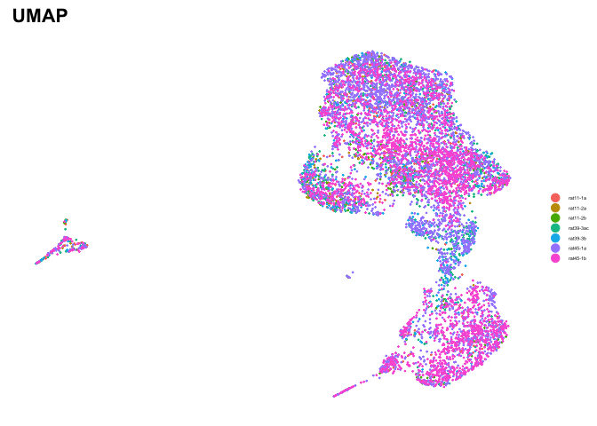

``` r
DimPlot(object = data.integrated, reduction = "tsne", group.by = "orig.ident") + NoAxes() + small.leg + ggtitle("tSNE")
```

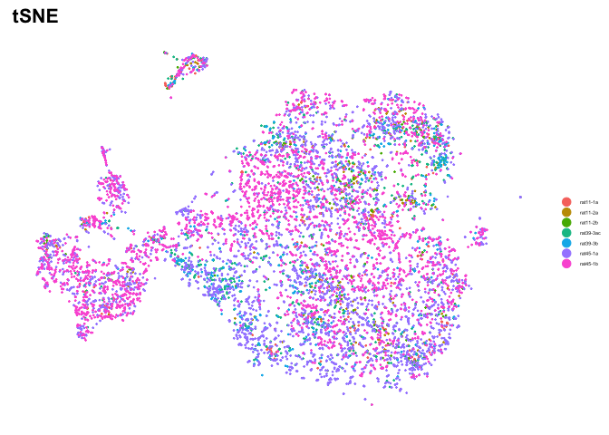

Some of the cells that were in the neuronal cluster in the 10X
integration are now at one tip of the astro cluster with tSNE and an
outlier group in UMAP.

### Plot marker genes

OBS! Before was in integrated space, now plot as RNA expression.

``` r
data.rna <- data.integrated
data.rna@active.assay <- "RNA"

# plot some marker genes.
plot.genes <- c("TH","SLC6A3","SNAP25","GAP43", "NEFL","DLK1","OLIG1","GFAP","AQP4","COL1A1","DCN","FBLN1")
p1 <- FeaturePlot(data.rna, features = plot.genes, reduction = "tsne", pt.size = 0.2, combine = F, cols = c("yellow","red","black"))
p1 <- lapply(p1, function(x) x + NoAxes() + NoLegend())
grid.arrange(grobs=p1, ncol=4)
```

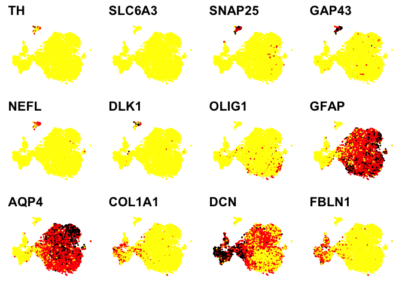

### Run clustering

``` r
# cluster
set.seed(1)
data.integrated <- FindNeighbors(object = data.integrated, dims = sel.pc, verbose = F, k.param = 15, force.recalc = T)
data.integrated <- FindClusters(object = data.integrated, resolution = 0.05, verbose = F)


# plot clustering
DimPlot(data.integrated, reduction = "umap", label = T) + NoAxes()
```

    ## Warning: Using `as.character()` on a quosure is deprecated as of rlang 0.3.0.
    ## Please use `as_label()` or `as_name()` instead.
    ## This warning is displayed once per session.

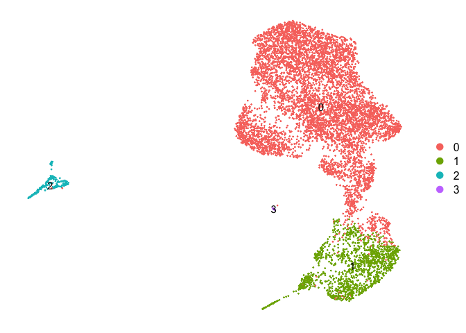

``` r
DimPlot(data.integrated, reduction = "tsne", label = T) + NoAxes()
```

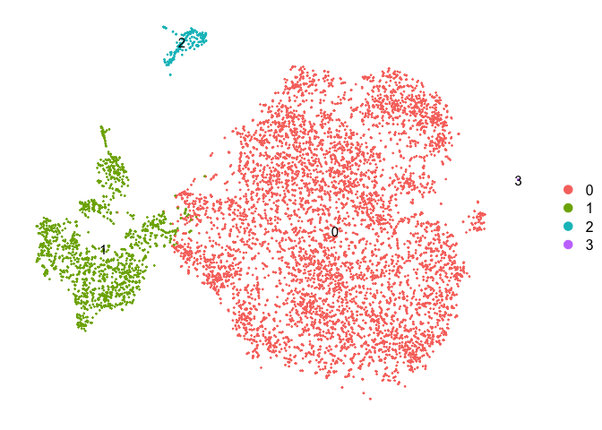

``` r
# split by sample
DimPlot(object = data.integrated, reduction = "umap", split.by = "Sample")
```

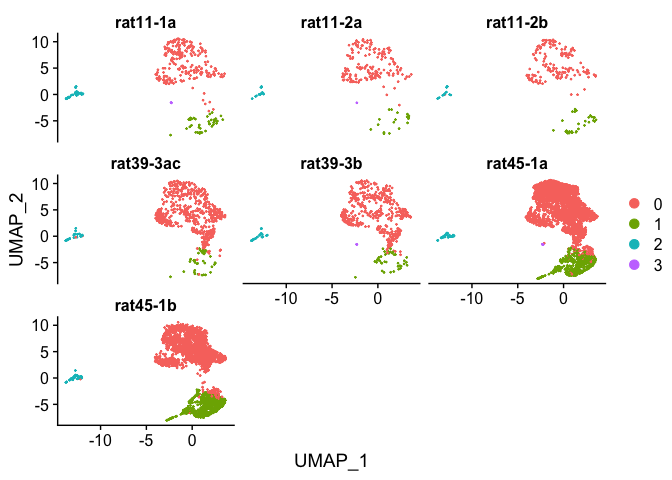

Number of cells from each sample to each cluster:

``` r
s <- split(data.integrated@active.ident,data.integrated@meta.data$orig.ident)
s <- lapply(s,table)
overlap <- Reduce(rbind,s)
rownames(overlap) <- names(s)


pheatmap(overlap, cluster_cols = F, cluster_rows = F, scale = "row", display_numbers = overlap, legend = F)
```


Number of cells per cluster

``` r
table(data.integrated@active.ident)
```

    ## 
    ##    0    1    2    3 
    ## 6273 1394  196   12

### Check rat reads.

Add proportion rat reads to the metadata and plot onto tsne and as
violins per cluster.

``` r
# add in proportion rat reads into the meta data
samples <- unique(data.integrated@meta.data$Sample)
data.integrated@meta.data$rat.ratio <- 0
data.integrated@meta.data$rat.umis <- 0

for (s in samples){
  sname <- gsub("-","_", s)
  rat.ratio <-  read.table(sprintf("../data/processed2/rat_filtering_%s.csv", sname), sep=",")
  rownames(rat.ratio) <- paste(s,rownames(rat.ratio), sep="_")
  rat.ratio <- rat.ratio[rownames(rat.ratio) %in% colnames(data.integrated),]
  data.integrated@meta.data$rat.ratio[match(rownames(rat.ratio),colnames(data.integrated))] <- rat.ratio$ratio
  data.integrated@meta.data$rat.umis[match(rownames(rat.ratio),colnames(data.integrated))] <- rat.ratio$rat_reads
}

FeaturePlot(data.integrated, features = c("rat.ratio","rat.umis"), reduction = "tsne")
```

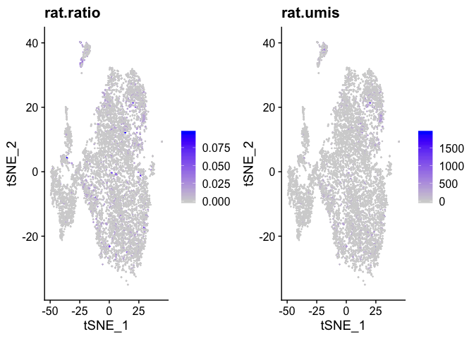

``` r
VlnPlot(data.integrated, features = c("rat.ratio","rat.umis"), pt.size = 0.1)
```

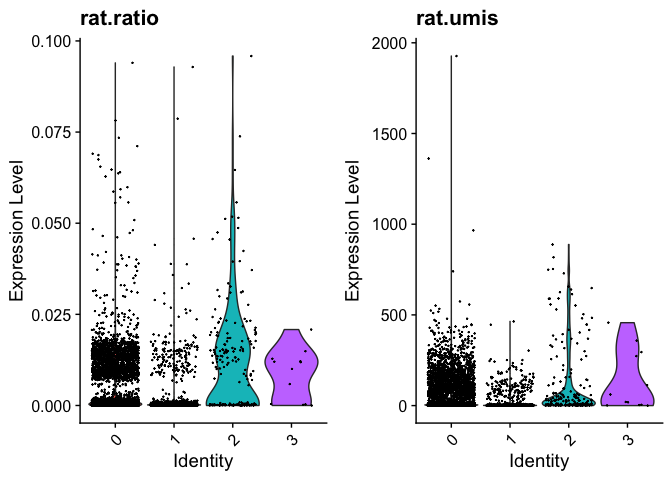

### Run DE detection

Run all tests with the normalized RNA data and plot as such.

``` r
data.rna <- data.integrated
data.rna@active.assay <- "RNA"

printfile <- "../data/processed2/integrated/integrate_rat_marker_genes_scale_res0.1.txt"
force <- FALSE

  if (force | !file.exists(printfile)){
    print("running FindMarkers")
    markers <- FindAllMarkers(data.integrated, verbose = T, assay = "RNA")
    write.table(markers, file=printfile)
  }else {
    print(sprintf("reading file %s",printfile))
    markers <- read.table(printfile)
  }
```

    ## [1] "reading file ../data/processed2/integrated/integrate_rat_marker_genes_scale_res0.1.txt"

Plot heatmap with top DE genes

``` r
# Plot heatmap with top DE genes
  per.cluster <- split(markers, markers$cluster)
  top10 <- lapply(per.cluster, function(x) x$gene[x$avg_logFC>0][1:10])
  top10 <- unique(na.omit(unlist(top10)))
  plotgenes <- list()
  plotgenes[[1]]<-top10
  nPlot <- 50
  if (length(top10) > nPlot){
    # plot 60 per page
    splitN <- ceiling(length(top10)/nPlot)
    plotgenes <- split(top10, cut_number(1:length(top10), splitN))
  }
  for (i in 1:length(plotgenes)){
    print(DoHeatmap(data.rna, features = plotgenes[[i]], slot="data"))
  }
```

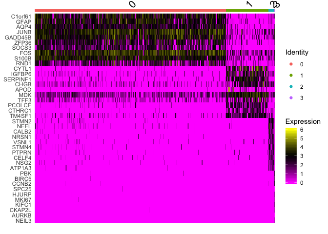

Plot top DE genes onto UMAP.

``` r
top8 <- lapply(per.cluster, function(x) as.character(x$gene[x$avg_logFC>0][1:8]))
plots <- list()

for (cl in names(top8)){
    cc <- colnames(data.integrated)[data.integrated@active.ident == cl]
    p0 <- DimPlot(data.rna, reduction = "umap", pt.size = 0.1, cells.highlight = cc)  + NoAxes() + NoLegend() + ggtitle(sprintf("cluster %s",cl)) + theme(plot.title = element_text(size=6),  plot.margin = rep(unit(0,"null"),4) , panel.spacing = unit(0,"null"))
    p1 <- FeaturePlot(data.rna, features = top8[[cl]], pt.size = 0.1, reduction = "umap", combine = F, cols = c("yellow","red","black"))
    p1 <- lapply(p1, function(x) x + NoAxes() + NoLegend() + theme(plot.title = element_text(size=6),plot.margin = rep(unit(0,"null"),4) , panel.spacing = unit(0,"null")))
    p1$cl <- p0
    p1 <- p1[c(9,1:8)]
    plots <- append(plots,p1)
}

nPage <- ceiling(length(top8)/6)
for (p in 1:nPage){
    idx <- (p*54-53):min(p*54,length(top8)*9)
    grid.arrange(grobs = plots[idx], ncol=9, nrow=6)
}
```

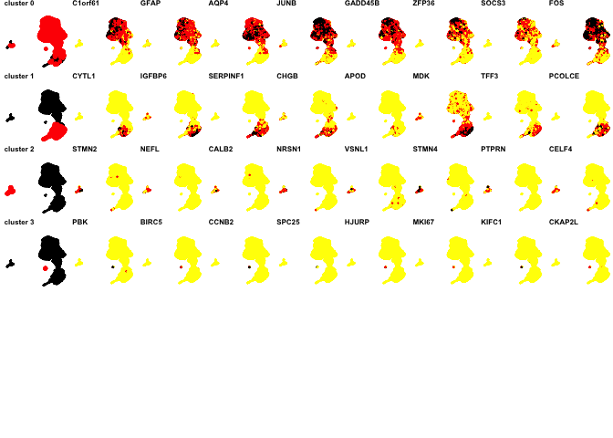

### New celltype prediction

Based on new integrated clusters.

``` r
overlap_phyper2<-function(L1,L2,bg=length(unique(c(unlist(L1),unlist(L2))))){
   # takes two list with indices and creates a matrix with pvalue for overlap between elements
   # phyper test uses all entries in L as background if bg is not specified.
   nL1<-length(L1)
   nL2<-length(L2)
   M<-mat.or.vec(nL1,nL2)
   P<-mat.or.vec(nL1,nL2)
   P[,]<-1
   for (i in 1:nL1){
      for (j in  1:nL2){
        M[i,j]<-length(intersect(L1[[i]],L2[[j]]))
        if (length(L1[[i]])==0 | length(L2[[j]])==0 ) {
          P[i,j] <- 1
        }else{
          P[i,j]<-1-phyper(M[i,j],length(L1[[i]]),bg-length(L1[[i]]),length(L2[[j]]))
        }
      }
   }
   colnames(P)<-names(L2)
   rownames(P)<-names(L1)
   colnames(M)<-names(L2)
   rownames(M)<-names(L1)   
   
   return(list(P=P,M=M))
}

# read panglaoDB file
pd <- read.table("/Users/asbj/local/projects/sc-devop/celltyping/data/PanglaoDB_all_cells_190215.txt", sep="\t", header=T, quote='')
pd.sets <- split(as.vector(pd$official.gene.symbol), pd$cell.type)

  # split genes by cluster
  s <- split(markers, markers$cluster)
  sig.up <- lapply(s, function(x) as.vector(x[x$avg_logFC>0 & x$p_val_adj<0.01,]$gene))

  # background is all genes expressed
  rs <- rowSums(data.integrated@assays$RNA@data)

  bg <- sum(rs > 0)

  ph <- overlap_phyper2(pd.sets, sig.up, bg=bg)$P

  # select top 3 celltypes per cluster to plot
  nTop = 3
  topG <- unique(as.vector(apply(ph, 2, function(x) order(x)[1:nTop])))
  selected <- ph[topG,]

  pheatmap(-log10(selected+1e-17))
```

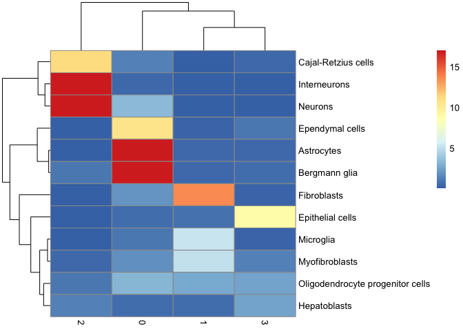

``` r
  # assign a label to each cluster by its top scoring celltype
  top.ct <- apply(selected,2,which.min)
  assigned <- rownames(selected)[top.ct]
  # if p-value > 0.1 set as NA
  assigned[apply(selected,2,min)>0.1] <- NA

  names(assigned) <- colnames(selected)
  data.integrated <- AddMetaData(data.integrated, assigned[as.character(data.integrated@active.ident)], col.name="CelltypeI")
  print(DimPlot(object = data.integrated, reduction = "tsne", group.by = "CelltypeI"))
```

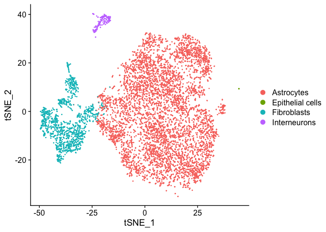

``` r
  print(DimPlot(object = data.integrated, reduction = "umap", group.by = "CelltypeI"))
```

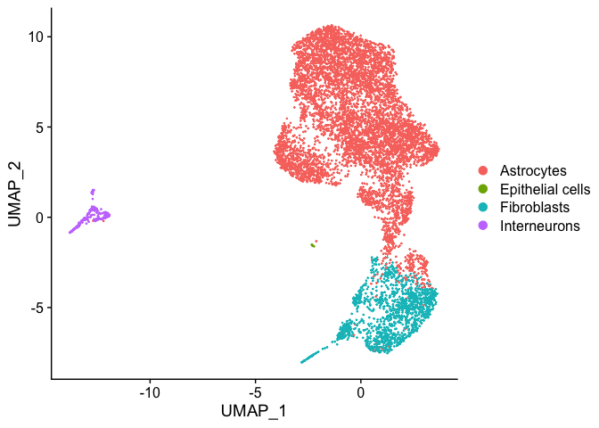

### Clustering overlap

Compare to clustering with the individual datasets.

``` r
cl.before  <- data.integrated@meta.data$RNA_snn_res.0.6
sample.def <- data.integrated@meta.data$orig.ident
cl.def <- paste(sample.def,cl.before, sep="_cl")

data.integrated <- AddMetaData(data.integrated, cl.def, col.name="IndividualClusters")

# Cluster overlap
l1 <- split(1:ncol(data.integrated),data.integrated@meta.data$integrated_snn_res.0.05)
l2 <- split(1:ncol(data.integrated), cl.def)
o <- overlap_phyper2(l1,l2)

pheatmap(-log10(o$P+1e-16), cluster_rows = F, cluster_cols = F, display_numbers = o$M)
```

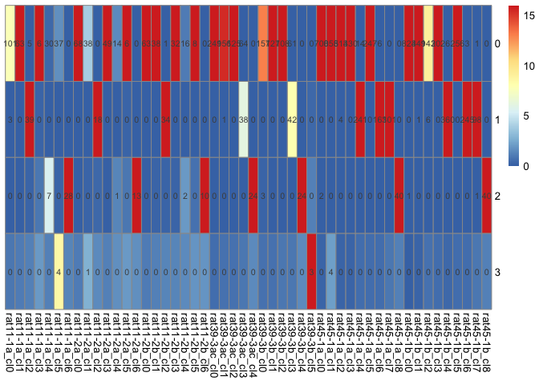

``` r
# and count total number of cells in each cluster
table(data.integrated@active.ident)
```

    ## 
    ##    0    1    2    3 
    ## 6273 1394  196   12

The 2 clear neuronal clusters (cluster9 & cluster10), have 174 and 57
cells, of which 35 are SS2 (all in cluster 9).

Before (without SS2 data) it was 139 + 58 cells in the two neuron
clusters (8 & 10), so 1 cell have moved from neuronal cluster to another
cluster.

### Save data

``` r
save(data.integrated, file = "../data/processed2/integrated/seurat_integrated_rat_scale_res0.1.Rdata")
```

Compare to mouse brain atlas
============================

Read in the mouse brain atlas data and get a list of marker genes to
calculate correlations on.

``` r
suppressMessages(library(loomR))
# to load loomR - need to first unload ‘dplyr’, ‘httr’?

lfile <- connect(filename = "../../data/linnarsson_atlas/l5_all.agg.loom", mode = "r", skip.validate = T)

exprs <- lfile[["matrix"]][,]
exprs <- t(exprs)

names <- lfile[["col_attrs"]]$names
clust <- lfile[["col_attrs/ClusterName"]][]
colnames(exprs) <- clust

gene.names <- lfile[["row_attrs/Gene"]][]
rownames(exprs) <- gene.names

# attr.df <- lfile$get.attribute.df(MARGIN = 2, attribute.names = names)
# does not work to run get.attribute, 
#  An object with name col_attrs/cell_names does not exist in this group

M <- list()
for (n in names){
  M[[n]] <- lfile[["col_attrs"]][[n]][]
}
M <- Reduce(cbind,M)
rownames(M) <- clust
colnames(M) <- names
M <- data.frame(M)

# extract all their marker genes
markersA <- unique(unlist(sapply(as.vector(M$MarkerGenes), strsplit, " ")))
#length(markersA)

# and our marker genes
markers2 <- unique(markers[markers$p_val_adj<0.001,"gene"])
#length(markers2)
```

Translate human to mouse genes.

``` r
transfile <- "../data/processed2/linnarsson_atlas/human_gene_translations.txt"

# get ensembl ids for the human genes
gene.info <- read.table("../data/processed2/gene_annotation.tsv", sep="\t", quote='', header=T)
human.ensembl <- gene.info$ensembl_gene_id

if (file.exists(transfile)){
  gene.translation <- read.table(transfile)
}else{

  library(biomaRt)
  # Load human ensembl attributes
  #human = biomaRt::useMart("ensembl", dataset = "hsapiens_gene_ensembl")
  human <- useMart(host="uswest.ensembl.org", "ENSEMBL_MART_ENSEMBL", dataset="hsapiens_gene_ensembl")
  # Load mouse ensembl attributes
  #mouse = biomaRt::useMart("ensembl", dataset = "mmusculus_gene_ensembl")
  mouse <- useMart(host="uswest.ensembl.org", "ENSEMBL_MART_ENSEMBL", dataset="mmusculus_gene_ensembl")
  
  # Link both datasets and retrieve human gene id + name
  gene.translation = biomaRt::getLDS(attributes = c("external_gene_name","ensembl_gene_id"), filters = "ensembl_gene_id", values = human.ensembl , mart = human, attributesL = c("ensembl_gene_id","external_gene_name"), martL = mouse, uniqueRows = T)

  #head(gene.translation)
  
  # only keep genes that also exists in the expression data
  matches1 <- sapply(gene.translation$Gene.name, match, rownames(data.integrated@assays$RNA@counts))
  matches2 <- sapply(gene.translation$Gene.name.1, match, rownames(exprs))
  keep <- (is.na(matches1) + is.na(matches2) )==0
  gene.translation <- gene.translation[keep,]
    
  write.table(gene.translation, file=transfile)
}

# select only genes that are expressed in 10 cells our data
nE <- rowSums(data.integrated@assays$RNA@counts > 0)
expressed.genes <- rownames(data.integrated@assays$RNA@counts)[nE>10]
gene.translation <- gene.translation[gene.translation$Gene.name %in% expressed.genes,]

# select only genes that are among the marker genes
keep.markersA <- which(gene.translation$Gene.name.1 %in% markersA)
keep.markers2 <- which(gene.translation$Gene.name %in% markers2)
print("our markers:")
```

    ## [1] "our markers:"

``` r
length(keep.markers2)
```

    ## [1] 3376

``` r
print("atlas markers:")
```

    ## [1] "atlas markers:"

``` r
length(keep.markersA)
```

    ## [1] 905

``` r
print("in both:")
```

    ## [1] "in both:"

``` r
length(intersect(keep.markers2,keep.markersA))
```

    ## [1] 295

``` r
keep.markers <- union(keep.markersA,keep.markers2)
print("total markers:")
```

    ## [1] "total markers:"

``` r
length(keep.markers)
```

    ## [1] 3986

``` r
# only 201 genes as markers in both datasets.
gene.translation <- gene.translation[keep.markers,]
```

Calculate mean expression across the markers for our data. And fetch
mean expression for the same markers in the atlas data.

``` r
# use the norm.data slot.
exprR <- data.integrated@assays$RNA@data
exprR <- exprR[gene.translation$Gene.name,]

clust2cell <- split(1:ncol(data.integrated), data.integrated@active.ident)
exprsC <- Reduce(cbind,lapply(clust2cell, function(x) rowMeans(exprR[,x])))
colnames(exprsC) <- names(clust2cell)

exprsA <- log2(exprs[match(gene.translation$Gene.name.1, rownames(exprs)),]+1)
```

Calculate correlations

``` r
cC <- cor(exprsC,exprsA, method = "spearman")

include.annot <- c("TaxonomyRank1","TaxonomyRank2","TaxonomyRank3","TaxonomyRank4")
colorsC <- M[,include.annot]
  
# keep order for atlas cells by their Taxonomy ranks
o <- order(M$TaxonomyRank1, M$TaxonomyRank2, M$TaxonomyRank3)
pheatmap(cC[,o], annotation_col = colorsC[,1:3], cluster_cols = F, show_colnames = F, fontsize = 6) 
```

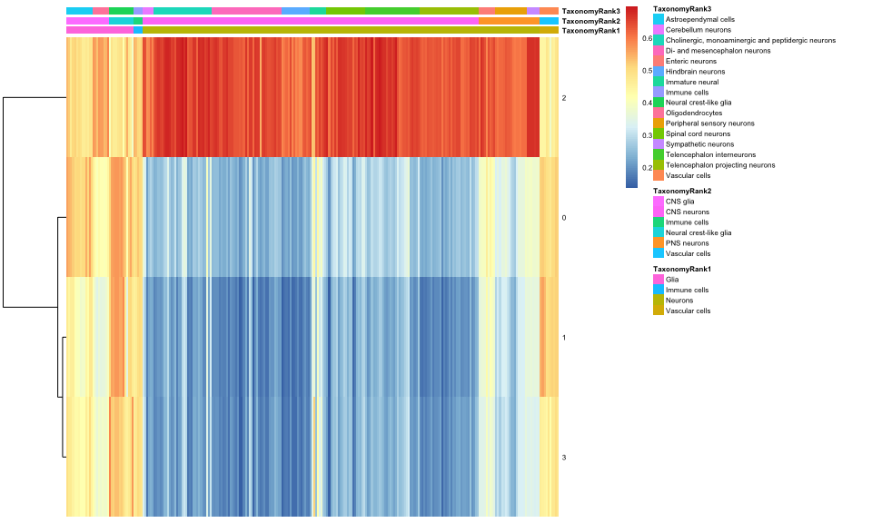

Top correlation per cluster, print top 6 correlating atlas clusters.

``` r
# top correlation per group are clusters:
for(c in rownames(cC)){
  print(c)
  print(head(sort(cC[c,],decreasing = T)))
}
```

    ## [1] "0"
    ##     ENTG3     ENTG6     ENTG7     ENTG2      EPSC     ENTG4 
    ## 0.5743409 0.5740808 0.5722063 0.5637752 0.5629415 0.5612458 
    ## [1] "1"
    ##     ENMFB     ENTG6     ENTG3     VLMC2     ENTG4     ENTG2 
    ## 0.5851283 0.5740822 0.5727973 0.5593618 0.5593453 0.5567381 
    ## [1] "2"
    ##    HYPEP5    HYPEP4    TEINH9    TEINH7   TEINH21    SCINH3 
    ## 0.6983047 0.6966073 0.6961948 0.6938165 0.6900259 0.6852312 
    ## [1] "3"
    ##     ENTG1     SATG1     ENTG3     ENTG6     ENTG4     ENTG7 
    ## 0.5899403 0.5702126 0.5331693 0.5306720 0.5242151 0.5196164

### Linnarsson data at tax level 4

Calculate mean expression at level 4 and compare to our clusters.

``` r
level4 <- split(1:ncol(exprsA), M$TaxonomyRank4)
get.mean <- function(x){
  if (length(x) == 1) { return(exprsA[,x])}
  else { return(rowMeans(exprsA[,x]))}
}
mean.level4 <- lapply(level4, get.mean)
exprs4 <- Reduce(cbind, mean.level4)
colnames(exprs4) <- names(level4)

#make color def for Tax rank2 
tax2 <- as.character(M[match(names(level4), M$TaxonomyRank4),]$TaxonomyRank2)
colorsC <- data.frame(TaxonomyRank2 =  tax2)
rownames(colorsC) <- names(level4)

c4S <- cor(exprsC,exprs4, method = "spearman")
pheatmap(c4S, fotsize_col = 8, annotation_col = colorsC)
```

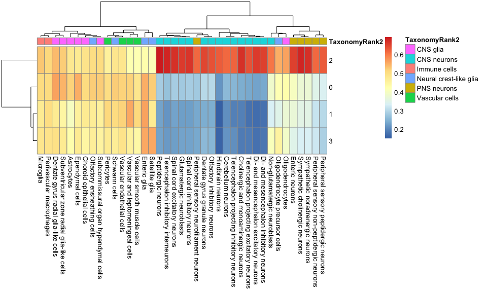

Take top correlating brain atlas cluster and predict celltype for our
clusters.

``` r
#for(c in rownames(c4S)){
#  print(c)
#  print(head(sort(c4S[c,],decreasing = T),3))
#}
new <- data.integrated

new.annot <- colnames(c4S)[apply(c4S, 1,which.max)]
names(new.annot) <- rownames(c4S)
new@meta.data$CelltypeMBA <- new.annot[new@active.ident]
print(new.annot)
```

    ##                                      0 
    ## "Dentate gyrus radial glia-like cells" 
    ##                                      1 
    ##                         "Enteric glia" 
    ##                                      2 
    ##                  "Peptidergic neurons" 
    ##                                      3 
    ##                         "Enteric glia"

``` r
DimPlot(new, group.by = "CelltypeMBA", label = T) + NoAxes() + NoLegend()
```

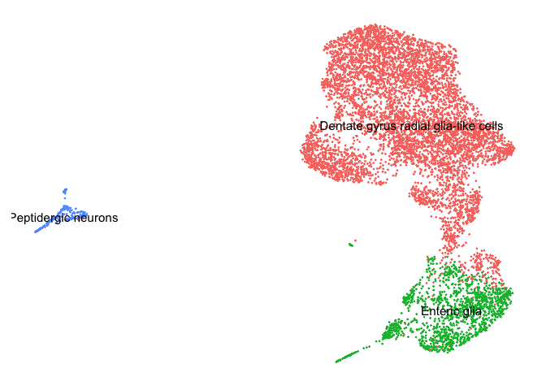

### Make a plot with only the Enteric glia subclusters

``` r
enteric <- grep("Enteric glia", M$TaxonomyRank4)
cE <- cor(exprsC,exprsA[,enteric], method = "spearman")
pheatmap(cE)
```


Proportion cells from different sortings
========================================

Visualize per cluster:

-   Number of cells from each rat
-   Number of cells from different sortings

And opposite, for each rat - visualize how the cells are distributed to
different clusters.

``` r
meta <- new@meta.data

ggplot(meta, aes(x=integrated_snn_res.0.05,fill=Rat)) + geom_bar()
```


``` r
ggplot(meta, aes(x=integrated_snn_res.0.05,fill=Rat)) + geom_bar(position = "fill") 
```

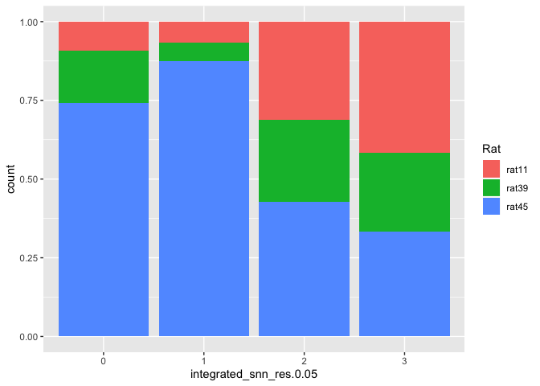

``` r
ggplot(meta, aes(x=integrated_snn_res.0.05,fill=Type)) + geom_bar(position = "fill") 
```

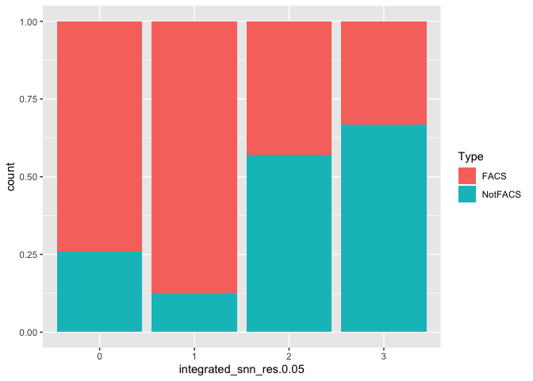

``` r
# per rat instaed.
ggplot(meta, aes(x=Rat, fill=integrated_snn_res.0.05)) + geom_bar()
```

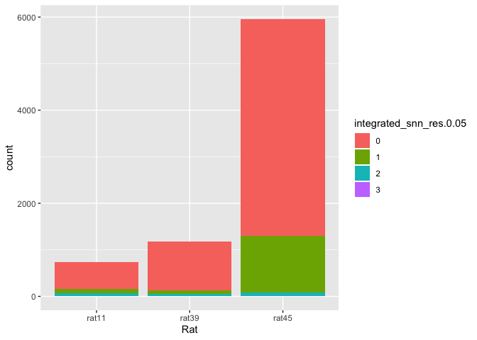

``` r
ggplot(meta, aes(x=Rat, fill=integrated_snn_res.0.05)) + geom_bar(position = "fill") 
```


``` r
sessionInfo()
```

    ## R version 3.5.1 (2018-07-02)
    ## Platform: x86_64-apple-darwin13.4.0 (64-bit)
    ## Running under: macOS  10.15.2
    ## 
    ## Matrix products: default
    ## BLAS/LAPACK: /Users/asbj/miniconda3/envs/seurat3/lib/R/lib/libRblas.dylib
    ## 
    ## locale:
    ## [1] en_US.UTF-8/en_US.UTF-8/en_US.UTF-8/C/en_US.UTF-8/en_US.UTF-8
    ## 
    ## attached base packages:
    ## [1] stats     graphics  grDevices utils     datasets  methods   base     
    ## 
    ## other attached packages:
    ##  [1] loomR_0.2.0      itertools_0.1-3  iterators_1.0.12 hdf5r_1.2.0     
    ##  [5] R6_2.4.0         pheatmap_1.0.12  ggplot2_3.2.1    gridExtra_2.3   
    ##  [9] Matrix_1.2-17    Seurat_3.0.0    
    ## 
    ## loaded via a namespace (and not attached):
    ##  [1] tsne_0.1-3          nlme_3.1-141        bitops_1.0-6       
    ##  [4] bit64_0.9-7         RColorBrewer_1.1-2  httr_1.4.1         
    ##  [7] rprojroot_1.3-2     sctransform_0.2.0   tools_3.5.1        
    ## [10] backports_1.1.5     irlba_2.3.3         KernSmooth_2.23-15 
    ## [13] lazyeval_0.2.2      colorspace_1.4-1    withr_2.1.2        
    ## [16] npsurv_0.4-0        tidyselect_0.2.5    bit_1.1-14         
    ## [19] compiler_3.5.1      plotly_4.9.0        labeling_0.3       
    ## [22] caTools_1.17.1.2    scales_1.0.0        lmtest_0.9-37      
    ## [25] ggridges_0.5.1      pbapply_1.4-2       stringr_1.4.0      
    ## [28] digest_0.6.22       rmarkdown_1.10      R.utils_2.9.0      
    ## [31] pkgconfig_2.0.3     htmltools_0.4.0     bibtex_0.4.2       
    ## [34] htmlwidgets_1.5.1   rlang_0.4.1         zoo_1.8-6          
    ## [37] jsonlite_1.6        ica_1.0-2           gtools_3.8.1       
    ## [40] dplyr_0.8.3         R.oo_1.22.0         magrittr_1.5       
    ## [43] Rcpp_1.0.2          munsell_0.5.0       ape_5.3            
    ## [46] reticulate_1.13     lifecycle_0.1.0     R.methodsS3_1.7.1  
    ## [49] stringi_1.4.3       yaml_2.2.0          gbRd_0.4-11        
    ## [52] MASS_7.3-51.4       gplots_3.0.1.1      Rtsne_0.15         
    ## [55] plyr_1.8.4          grid_3.5.1          parallel_3.5.1     
    ## [58] gdata_2.18.0        listenv_0.7.0       ggrepel_0.8.1      
    ## [61] crayon_1.3.4        lattice_0.20-38     cowplot_1.0.0      
    ## [64] splines_3.5.1       SDMTools_1.1-221.1  zeallot_0.1.0      
    ## [67] knitr_1.20          pillar_1.4.2        igraph_1.2.4.1     
    ## [70] future.apply_1.3.0  reshape2_1.4.3      codetools_0.2-16   
    ## [73] glue_1.3.1          evaluate_0.14       lsei_1.2-0         
    ## [76] metap_1.1           data.table_1.12.6   vctrs_0.2.0        
    ## [79] png_0.1-7           Rdpack_0.11-0       gtable_0.3.0       
    ## [82] RANN_2.6.1          purrr_0.3.3         tidyr_1.0.0        
    ## [85] future_1.14.0       assertthat_0.2.1    rsvd_1.0.2         
    ## [88] survival_2.44-1.1   viridisLite_0.3.0   tibble_2.1.3       
    ## [91] cluster_2.1.0       globals_0.12.4      fitdistrplus_1.0-14
    ## [94] ROCR_1.0-7
