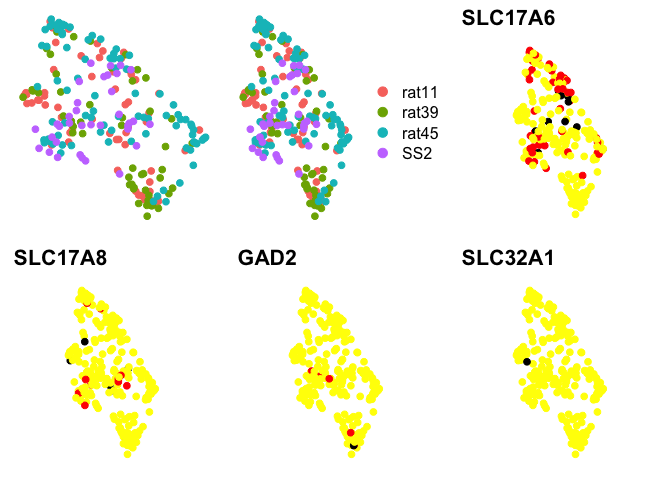
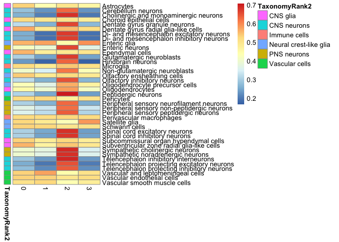

Plot figures for manuscript. Use the integrated object from
Data\_integration\_rats\_wSS2\_scale\_nDet\_res0.1.Rmd

Plot UMAP with:

-   Clusters (4 main celltypes)
-   FACS/NotFACS
-   SS2/10x

Heatmap with top DE genes per cluster.

Violin plots for the 4 clusters - same markers as in SS2 data only.

Cluster scores for cycling cells - Astro vs FBLC

Brain atlas plot for integrated data

``` r
suppressMessages(require(Seurat))
suppressMessages(require(Matrix))
suppressMessages(require(gridExtra))
suppressMessages(require(ggplot2))
suppressMessages(require(pheatmap))
```

``` r
load(file = "../data/processed2/integrated/seurat_integrated_rat_SS2_scale_res0.1.Rdata")

# reassing cluster names to celltypes
celltypes <- c("Astrocyte","FBLC","Neuron","Cycling")
names(celltypes) <- as.character(0:3)

ct <- celltypes[data.integrated@active.ident]
data.integrated <- AddMetaData(data.integrated, ct, col.name = "CelltypeCluster")
```

### plot UMAPs

``` r
# make one version with labels in plot
scaleC <- scale_colour_manual(values = c("blue1", "gray","green3", "red1"))

# Per cluster with legend
p1 <- DimPlot(data.integrated, group.by = "CelltypeCluster") + NoAxes() +scaleC

# one with FACS/notFACS
# add in FACS for the SS2 data in meta.data
data.integrated@meta.data$Type[data.integrated@meta.data$orig.ident=="RC17"] <- "FACS"
p2 <- DimPlot(data.integrated, group.by = "Type", order = c("NotFACS","FACS")) + NoAxes() + scale_colour_manual(values = c("cyan", "magenta"))

# one with Rat
data.integrated@meta.data$Rat[data.integrated@meta.data$orig.ident=="RC17"] <- "SS2"
p3 <- DimPlot(data.integrated, group.by = "Rat") + NoAxes()

# one with SS2 vs 10x
lib.prep <- rep("10x",ncol(data.integrated))
lib.prep[data.integrated@meta.data$orig.ident=="RC17"] <- "SS2"
data.integrated <- AddMetaData(data.integrated, lib.prep, col.name = "LibraryPrep")
p4 <- DimPlot(data.integrated, group.by = "LibraryPrep") + NoAxes() + scale_colour_manual(values = c("gray", "black"))

pdf("../data/figures2/umap_integrated.pdf")
grid.arrange(p1,p2,p3,p4, ncol=2)

# all same plots without legends.
p1 <- DimPlot(data.integrated, group.by = "CelltypeCluster") + NoAxes() + 
  scaleC + NoLegend() + ggtitle("Clusters")
p2 <- DimPlot(data.integrated, group.by = "Type", order = c("NotFACS","FACS")) + NoAxes() + NoLegend() + 
  scale_colour_manual(values = c("cyan", "magenta")) + ggtitle("FACS type")
p3 <- DimPlot(data.integrated, group.by = "LibraryPrep") + NoAxes() + NoLegend() + 
  scale_colour_manual(values = c("gray", "black")) + ggtitle("Library prep")
p4 <- DimPlot(data.integrated, group.by = "Rat") + NoAxes() + NoLegend() + ggtitle("Rat")
grid.arrange(p1,p2,p3,p4, ncol=2)
dev.off()
```

    ## quartz_off_screen 
    ##                 2

### plot barplots with contributions to clusters

``` r
# take all same categories and plot as barplots the number of cells from these categories per cluster.
meta <- data.integrated@meta.data


p1<-ggplot(meta, aes(x=CelltypeCluster,fill=Rat)) + geom_bar(position = "fill") + theme_classic()
p2<-ggplot(meta, aes(x=CelltypeCluster,fill=Type)) + geom_bar(position = "fill") + theme_classic() + scale_fill_manual(values = c("cyan", "magenta"))
p3<-ggplot(meta, aes(x=CelltypeCluster,fill=LibraryPrep)) + geom_bar(position = "fill") + theme_classic() + scale_fill_manual(values = c("gray", "black"))
pdf("../data/figures2/barplot_integrated_cell_contribution.pdf")
grid.arrange(p1,p2,p3,ncol=2)
dev.off()
```

    ## quartz_off_screen 
    ##                 2

### Make a table with number of cells per clusters

``` r
all.cells <- table(meta$CelltypeCluster)
s <- split(meta$CelltypeCluster, meta$orig.ident)
t2 <- Reduce(rbind,lapply(s, function(x) table(factor(x, levels=names(all.cells)))))
rownames(t2)<-names(s)
facs.10x <- colSums(t2[grepl("rat45",rownames(t2)),]) 
notfacs.10x <- colSums(t2[grepl("rat11|rat39",rownames(t2)),]) 

cellinfo <- rbind(t2,facs.10x,notfacs.10x,all.cells)
total <- rowSums(cellinfo)
cellinfo <- cbind(cellinfo,total)

write.table(cellinfo, quote =F, file="../data/figures2/table_cells_per_cluster.txt")
```

### gene violin plots as in SS2 figure.

``` r
genes <- list()
genes$Astrocyte <-  c("AQP4", "GFAP", "SLC1A3",  "GJA1", "EDNRB", "SLC4A4")
genes$Oligodentrocyte <- c("OLIG1", "OLIG2","NKX2-2",  "SOX10",  "PLP1",  "PMP2")
genes$PanNeuronal <- c("GAP43", "RBFOX3","NSG2","SNAP25", "NEFL", "SYN1")
genes$DopamineNeuron <-c("TH","NR4A2","SLC18A2", "DDC",  "RET", "GFRA1")
genes$FBLC <- c("PDGFRA",   "COL1A1",  "COL1A2",  "LUM",     "DCN",     "FBLN1")

temp <- data.frame(t(data.integrated@assays$RNA@data[unlist(genes),]), check.names = F)
temp$cluster <- data.integrated@meta.data$CelltypeCluster
short <- temp$cluster
short[short=="Cycling"] <- "CC"
short[short=="Neuron"] <- "N"
short[short=="Astrocyte"] <- "AC"
temp$cluster <- short

pl <- list()
noleg <- theme(legend.position="none")
scaleF <- scale_fill_manual(values = c("blue1", "gray","green3", "red1"))
for (gene in unlist(genes)){
  pl[[gene]] <- ggplot() + geom_violin(data=temp,aes_(x=as.name("cluster"),y=as.name(gene),fill=as.name("cluster"), colour = as.name("cluster") ), scale="width") + 
    theme_void() + noleg + scaleF + scaleC + theme(title =element_text(size=6, face='bold')) + ggtitle(gene)
}

# OBS! to get it filled by row instead of column, rearrange the plots
pl2 <- pl[as.vector(t(matrix(names(pl),nrow=6)))]

pdf("../data/figures2/violins_integrated.pdf", width = 14, height = 7)
grid.arrange(grobs=pl2, nrow=6)
dev.off()
```

    ## quartz_off_screen 
    ##                 2

### Umap plots of gene list

Gene list from Katarina with genes (gene\_list\_NatureMedicine.csv)

``` r
genes2 <- read.table("../data/figures2/gene_list_NatureMedicine.csv", header = T)

genes2$symbol <- unlist(lapply(strsplit(as.character(genes2$Gene),":"), function(x) x[1]))

# is all the same genes as above except 5
# [1] "PCDH15"  "SLC17A6" "SLC17A8" "GAD2"    "SLC32A1"
m <- match(genes2$symbol, unlist(genes))
genes2[which(is.na(m)),"symbol"]
```

    ## [1] "PCDH15"  "SLC17A6" "SLC17A8" "GAD2"    "SLC32A1"

``` r
data.integrated@active.assay <- "RNA"
plots <- FeaturePlot(data.integrated, features = genes2$symbol, reduction = "umap", combine=F, cols = c("yellow","red","black"))
plots <- lapply(plots, function(x) x + NoAxes() + theme(legend.text = element_text(size=6)))

pdf("../data/figures2/umap_gene_plots.pdf", width = 10, height = 7)
for (i in 1:4){
  sel <- (i*9-8):min(i*9,length(plots))
  grid.arrange(grobs=plots[sel])
}
dev.off()
```

    ## quartz_off_screen 
    ##                 2

### Zoomed in on neuronal cluster

Plot some marker genes

``` r
selC <- colnames(data.integrated)[data.integrated@active.ident == 2]

neurons <- subset(data.integrated, cells = selC)

p1 <-  DimPlot(neurons, group.by = "Rat", pt.size = 2) + NoAxes() + NoLegend()

p2 <-  DimPlot(neurons, group.by = "Rat", pt.size = 2) + NoAxes() 

genesN <-  c("SLC17A6", "SLC17A8", "GAD2","SLC32A1")

pl <- FeaturePlot(neurons, features = genesN, combine = F, pt.size = 2, cols = c("yellow","red","black"))
pl <- lapply(pl, function(x) x + NoAxes() + NoLegend())

pl <- append(pl,list(a=p1,b=p2),0)

grid.arrange(grobs = pl, ncol=3)
```



``` r
pdf("../data/figures2/umap_neurons_gene_plots.pdf", width = 10, height = 7)
grid.arrange(grobs = pl, ncol=3)
dev.off()
```

    ## quartz_off_screen 
    ##                 2

### Heatmap top DE genes

``` r
printfile <- "../data/processed2/integrated/integrate_SS2_rat_marker_genes_scale_res0.1.txt"
markers <- read.table(printfile)

per.cluster <- split(markers, markers$cluster)

# reorder to plot Astro,CC,FBLC,N
per.cluster <- per.cluster[c(1,4,2,3)]
sig.up <- lapply(per.cluster, function(x) as.character(x$gene[x$avg_logFC>0 & x$p_val_adj<0.01]))


# take top 20 genes per cluster.
plot.genes <- unlist(lapply(sig.up, head, 20))
expr <- data.integrated@assays$RNA@data[plot.genes,]

# reorder by clusters
cl2cell <- split(colnames(data.integrated),  data.integrated$CelltypeCluster)
expr <- expr[,unlist(cl2cell)]

# add in metadata for cluster, annotationC
selM <- c("CelltypeCluster","LibraryPrep","Type")
annC <- data.integrated@meta.data[,selM]

# gaps
lens <- unlist(lapply(cl2cell,length))
gapsC <- cumsum(lens)[1:4]
gapsR <- seq(20,60,by=20)

# annotationR
annR <- data.frame(CelltypeCluster=rep(names(cl2cell), each=20))
rownames(annR) <- plot.genes
  

coldef.cl <- c("blue1", "gray","green3", "red1")
names(coldef.cl) <- names(cl2cell)


coldef.lin <- c("blue","darkblue","green","darkgreen","yellow","orange","red")
names(coldef.lin) <- c("Nxph4+","Nxph4+Th","Gad2+","Gad2+Th", "Slc6a3+", "Aldh1a1+", "Vip+")
coldef.lib <- c("gray","black")
names(coldef.lib) <- c("10x","SS2")
coldef.type <- c("cyan","magenta")
names(coldef.type) <- c("FACS","NotFACS")

ann_colors = list(
     CelltypeCluster = coldef.cl,
     LibraryPrep =  coldef.lib,
     Type = coldef.type
)

pdf("../data/figures2/gene_heatmap_integrated.pdf")
pheatmap(expr,  cluster_rows=F,cluster_cols=F,show_colnames=F,fontsize_row =5, annotation_col = annC, gaps_col = gapsC, gaps_row = gapsR, annotation_row = annR, annotation_colors = ann_colors)
dev.off()
```

    ## pdf 
    ##   3

``` r
# same but with scaling 0-1
scale.expr <- t(apply(expr,1,function(x) x/max(x)))
pdf("../data/figures2/gene_heatmap_integrated_scaled.pdf")
pheatmap(scale.expr,  cluster_rows=F,cluster_cols=F,show_colnames=F,fontsize_row =5, annotation_col = annC, gaps_col = gapsC, gaps_row = gapsR, annotation_row = annR, annotation_colors = ann_colors)
dev.off()
```

    ## pdf 
    ##   3

### Linnarson atlas plot

``` r
suppressMessages(library(loomR))
# to load loomR - need to first unload ‘dplyr’, ‘httr’?

lfile <- connect(filename = "../../data/linnarsson_atlas/l5_all.agg.loom", mode = "r", skip.validate = T)

exprs <- lfile[["matrix"]][,]
exprs <- t(exprs)

names <- lfile[["col_attrs"]]$names
clust <- lfile[["col_attrs/ClusterName"]][]
colnames(exprs) <- clust

gene.names <- lfile[["row_attrs/Gene"]][]
rownames(exprs) <- gene.names

# attr.df <- lfile$get.attribute.df(MARGIN = 2, attribute.names = names)
# does not work to run get.attribute, 
#  An object with name col_attrs/cell_names does not exist in this group

M <- list()
for (n in names){
  M[[n]] <- lfile[["col_attrs"]][[n]][]
}
M <- Reduce(cbind,M)
rownames(M) <- clust
colnames(M) <- names
M <- data.frame(M)

# extract all their marker genes
markersA <- unique(unlist(sapply(as.vector(M$MarkerGenes), strsplit, " ")))
#length(markersA)

# and our marker genes
markers2 <- unique(markers[markers$p_val_adj<0.001,"gene"])
#length(markers2)
```

Translate human to mouse genes.

``` r
transfile <- "../data/processed2/linnarsson_atlas/human_gene_translations.txt"
gene.translation <- read.table(transfile)
# get ensembl ids for the human genes
gene.info <- read.table("../data/processed2/gene_annotation.tsv", sep="\t", quote='', header=T)
human.ensembl <- gene.info$ensembl_gene_id


# select only genes that are expressed in 10 cells our data
nE <- rowSums(data.integrated@assays$RNA@counts > 0)
expressed.genes <- rownames(data.integrated@assays$RNA@counts)[nE>10]
gene.translation <- gene.translation[gene.translation$Gene.name %in% expressed.genes,]

# select only genes that are among the marker genes
keep.markersA <- which(gene.translation$Gene.name.1 %in% markersA)
keep.markers2 <- which(gene.translation$Gene.name %in% markers2)
keep.markers <- union(keep.markersA,keep.markers2)

# only 201 genes as markers in both datasets.
gene.translation <- gene.translation[keep.markers,]


# use the norm.data slot.
exprR <- data.integrated@assays$RNA@data
exprR <- exprR[gene.translation$Gene.name,]

clust2cell <- split(1:ncol(data.integrated), data.integrated@active.ident)
exprsC <- Reduce(cbind,lapply(clust2cell, function(x) rowMeans(exprR[,x])))
colnames(exprsC) <- names(clust2cell)

exprsA <- log2(exprs[match(gene.translation$Gene.name.1, rownames(exprs)),]+1)

level4 <- split(1:ncol(exprsA), M$TaxonomyRank4)
get.mean <- function(x){
  if (length(x) == 1) { return(exprsA[,x])}
  else { return(rowMeans(exprsA[,x]))}
}
mean.level4 <- lapply(level4, get.mean)
exprs4 <- Reduce(cbind, mean.level4)
colnames(exprs4) <- names(level4)

#make color def for Tax rank2 
tax2 <- as.character(M[match(names(level4), M$TaxonomyRank4),]$TaxonomyRank2)
colorsC <- data.frame(TaxonomyRank2 =  tax2)
rownames(colorsC) <- names(level4)

c4S <- cor(exprsC,exprs4, method = "spearman")

pdf("../data/figures2/linnarsson_atlas_comparison_integrated.pdf")
pheatmap(t(c4S), fotsize_col = 8, annotation_row = colorsC)
pheatmap(t(c4S), fotsize_col = 8, annotation_row = colorsC, cluster_rows = F, cluster_cols = F)
```



``` r
dev.off()
```

    ## pdf 
    ##   3

### Cluster profile scores for cycling cells

``` r
# take  top 100 genes
nG <- 100
sel <- lapply(sig.up, function(x) x[1:nG])
# calculate score - on integrated or rna space?
#data.integrated <- AddModuleScore(data.integrated, features = sel, ctrl=50, name="ClusterProfile")


data.integrated <- AddModuleScore(data.integrated, features = sel, ctrl=100, name="ClusterProfile",assay="RNA",nbin=2)

n <- colnames(data.integrated@meta.data)[grep("ClusterProfile",colnames(data.integrated@meta.data))]
names(sel)
```

    ## [1] "0" "3" "1" "2"

``` r
# order is Astro, Cycling, FBLC, Neuron
# 


p1 <- FeatureScatter(data.integrated, feature1 = n[1], feature2 = n[3],  cells = colnames(data.integrated)[Idents(data.integrated)==3]) + ggtitle("FBLC vs Astro") + NoLegend() + scale_color_manual(values = c("gray"))
p2 <- FeatureScatter(data.integrated, feature1 = n[1], feature2 = n[4], cells = colnames(data.integrated)[Idents(data.integrated)==3]) + ggtitle("Neuron vs Astro") + NoLegend() + scale_color_manual(values = c("gray"))
p3 <- FeatureScatter(data.integrated, feature1 = n[4], feature2 = n[3], cells = colnames(data.integrated)[Idents(data.integrated)==3]) + ggtitle("FBLC vs Neuron") + NoLegend() + scale_color_manual(values = c("gray"))
p4 <- FeatureScatter(data.integrated, feature1 = n[1], feature2 = n[2], cells = colnames(data.integrated)[Idents(data.integrated)==3]) + ggtitle("Cycling vs Astro") + NoLegend() + scale_color_manual(values = c("gray"))

pdf("../data/figures2/astro_fblc_scores_cycling_cells.pdf")
print(p1)
dev.off()
```

    ## quartz_off_screen 
    ##                 2

``` r
# color by rat does not work, do with ggplot instead?

cells <- colnames(data.integrated)[Idents(data.integrated)==3]
m <- data.integrated@meta.data[cells,]

p1 <- ggplot(m, aes(x= ClusterProfile1, y=ClusterProfile3, color = Rat)) + geom_point() + theme_classic() + ggtitle("FBLC vs Astro")
p2 <- ggplot(m, aes(x= ClusterProfile1, y=ClusterProfile4, color = Rat)) + geom_point() + theme_classic() + ggtitle("Neuron vs Astro")
p3 <- ggplot(m, aes(x= ClusterProfile4, y=ClusterProfile3, color = Rat)) + geom_point() + theme_classic() + ggtitle("FBLC vs Neuron")
p4 <- ggplot(m, aes(x= ClusterProfile1, y=ClusterProfile2, color = Rat)) + geom_point() + theme_classic() + ggtitle("Cycling vs Astro")
  
grid.arrange(p1,p2,p3,p4, ncol=2)
```


``` r
sessionInfo()
```

    ## R version 3.5.1 (2018-07-02)
    ## Platform: x86_64-apple-darwin13.4.0 (64-bit)
    ## Running under: macOS  10.15.2
    ## 
    ## Matrix products: default
    ## BLAS/LAPACK: /Users/asbj/miniconda3/envs/seurat3/lib/R/lib/libRblas.dylib
    ## 
    ## locale:
    ## [1] en_US.UTF-8/en_US.UTF-8/en_US.UTF-8/C/en_US.UTF-8/en_US.UTF-8
    ## 
    ## attached base packages:
    ## [1] stats     graphics  grDevices utils     datasets  methods   base     
    ## 
    ## other attached packages:
    ##  [1] loomR_0.2.0      itertools_0.1-3  iterators_1.0.12 hdf5r_1.2.0     
    ##  [5] R6_2.4.0         pheatmap_1.0.12  ggplot2_3.2.1    gridExtra_2.3   
    ##  [9] Matrix_1.2-17    Seurat_3.0.0    
    ## 
    ## loaded via a namespace (and not attached):
    ##  [1] tsne_0.1-3          nlme_3.1-141        bitops_1.0-6       
    ##  [4] bit64_0.9-7         RColorBrewer_1.1-2  httr_1.4.1         
    ##  [7] rprojroot_1.3-2     sctransform_0.2.0   tools_3.5.1        
    ## [10] backports_1.1.5     irlba_2.3.3         KernSmooth_2.23-15 
    ## [13] lazyeval_0.2.2      colorspace_1.4-1    withr_2.1.2        
    ## [16] npsurv_0.4-0        tidyselect_0.2.5    bit_1.1-14         
    ## [19] compiler_3.5.1      plotly_4.9.0        labeling_0.3       
    ## [22] caTools_1.17.1.2    scales_1.0.0        lmtest_0.9-37      
    ## [25] ggridges_0.5.1      pbapply_1.4-2       stringr_1.4.0      
    ## [28] digest_0.6.22       rmarkdown_1.10      R.utils_2.9.0      
    ## [31] pkgconfig_2.0.3     htmltools_0.4.0     bibtex_0.4.2       
    ## [34] htmlwidgets_1.5.1   rlang_0.4.1         zoo_1.8-6          
    ## [37] jsonlite_1.6        ica_1.0-2           gtools_3.8.1       
    ## [40] dplyr_0.8.3         R.oo_1.22.0         magrittr_1.5       
    ## [43] Rcpp_1.0.2          munsell_0.5.0       ape_5.3            
    ## [46] reticulate_1.13     lifecycle_0.1.0     R.methodsS3_1.7.1  
    ## [49] stringi_1.4.3       yaml_2.2.0          gbRd_0.4-11        
    ## [52] MASS_7.3-51.4       gplots_3.0.1.1      Rtsne_0.15         
    ## [55] plyr_1.8.4          grid_3.5.1          parallel_3.5.1     
    ## [58] gdata_2.18.0        listenv_0.7.0       ggrepel_0.8.1      
    ## [61] crayon_1.3.4        lattice_0.20-38     cowplot_1.0.0      
    ## [64] splines_3.5.1       SDMTools_1.1-221.1  zeallot_0.1.0      
    ## [67] knitr_1.20          pillar_1.4.2        igraph_1.2.4.1     
    ## [70] future.apply_1.3.0  reshape2_1.4.3      codetools_0.2-16   
    ## [73] glue_1.3.1          evaluate_0.14       lsei_1.2-0         
    ## [76] metap_1.1           data.table_1.12.6   vctrs_0.2.0        
    ## [79] png_0.1-7           Rdpack_0.11-0       gtable_0.3.0       
    ## [82] RANN_2.6.1          purrr_0.3.3         tidyr_1.0.0        
    ## [85] future_1.14.0       assertthat_0.2.1    rsvd_1.0.2         
    ## [88] survival_2.44-1.1   viridisLite_0.3.0   tibble_2.1.3       
    ## [91] cluster_2.1.0       globals_0.12.4      fitdistrplus_1.0-14
    ## [94] ROCR_1.0-7
