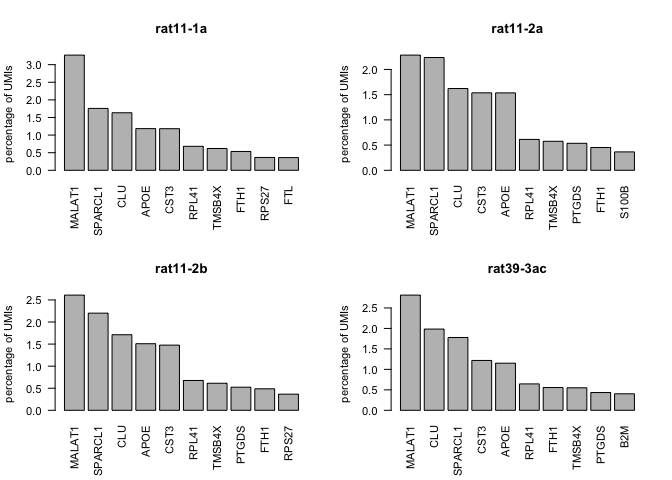

``` r
suppressMessages(require(Seurat))
suppressMessages(require(Matrix))
suppressMessages(require(ggplot2))
```

Read all dat
------------

Read the filtered matrices, filter out putative rat cells and create a
Seurat object.

OBS! Number of cells in hsa+rat mapping is more than for hsa only, due
to the different settings in the filtering options. For now, only keep
barcodes that are included in both datasets, are only a few cells. Need
to look at the unfiltered output from cellranger.

``` r
dirs <- c("../data/DataFiles/GRCh38_FACS/","../data/DataFiles/GRCh38_NotFACS/")

alldata <- list()
type <- list()
for (d in dirs){
  samples <- dir(d, pattern = "rat*")
  for (s in samples){
    features <- read.table(gzfile(paste(d,s,"/outs/filtered_feature_bc_matrix/features.tsv.gz", sep='')), header=F)
    barcodes <- read.table(gzfile(paste(d,s,"/outs/filtered_feature_bc_matrix/barcodes.tsv.gz", sep='')), header=F)
    m <- readMM(gzfile(paste(d,s,"/outs/filtered_feature_bc_matrix/matrix.mtx.gz", sep='')))

    colnames(m) <- barcodes[,1]
    
    # some gene names are duplicated - need to make them unique
    gene.names <- make.unique(as.character(features[,2]), sep= "-")
    rownames(m) <- gene.names
    alldata[[s]] <- m  
    
    type[[s]] <- unlist(strsplit(d,"[_/]"))[5]
  }
}

unlist(lapply(alldata, ncol))
```

    ## rat45_1a rat45_1b rat11_1a rat11_2a rat11_2b rat39_3a rat39_3b rat39_3c 
    ##     3496     2732      752      470      443     1298     1292     1236

### merge the 2 samples that were sequenced twice.

Merge all umi counts

``` r
mA <- alldata$`rat39_3a`
mC <- alldata$`rat39_3c`

both <- intersect(colnames(mA),colnames(mC))

mBoth <- mA[,both] + mC[,both]
colnames(mBoth) <- both

# add unique entries.
uniqueA <- setdiff(colnames(mA),both)
mBoth <- cbind(mBoth,mA[,uniqueA])

uniqueC <- setdiff(colnames(mC),both)
mBoth <- cbind(mBoth,mC[,uniqueC])

alldata[["rat39_3ac"]] <- mBoth

alldata$`rat39_3a` <- NULL
alldata$`rat39_3c` <- NULL

unlist(lapply(alldata, ncol))
```

    ##  rat45_1a  rat45_1b  rat11_1a  rat11_2a  rat11_2b  rat39_3b rat39_3ac 
    ##      3496      2732       752       470       443      1292      1304

``` r
type[["rat39_3ac"]] <- "NotFACS"
```

### Filter for rat contamination

And create seurat objects.

``` r
alldata2 <- list()
for (s in names(alldata)){
    m <- alldata[[s]]
  
    # read cells filtered on rat ratios and keep only those 
    rat.ratio <-  read.table(sprintf("../data/processed2/rat_filtering_%s.csv", s), sep=",")
    m <- m[, colnames(m) %in% rownames(rat.ratio)]
    # make name with also sample info
    sname <- sub("_","-",s)
    cell.names <- paste(sname,colnames(m),sep="_")  
    colnames(m) <- cell.names
    
    
    # make metadata
    t <- type[[s]]
    rat <- unlist(strsplit(sname,"-"))[1]
    meta <- data.frame(Sample = rep(sname, ncol(m)), Type = rep(t,ncol(m)),  Rat=rep(rat,ncol(m)))
    rownames(meta) <- colnames(m)
    
    data <- CreateSeuratObject(m, project = sname, meta.data = meta)
    alldata2[[sname]] <- data
}

# check number of cells per run
unlist(lapply(alldata2,ncol))
```

    ##  rat45-1a  rat45-1b  rat11-1a  rat11-2a  rat11-2b  rat39-3b rat39-3ac 
    ##      3468      2705       349       230       225       599       729

``` r
# create one seurat object
data.all <- merge(x=alldata2[[1]], y= alldata2[-1])

samples <- unique(data.all@meta.data$Sample)
```

### Fetch gene annotations

From biomart fetch biotype, chromosome, position, strand, for each gene.

``` r
gene.file <- "../data/processed2/gene_annotation.tsv"
if (file.exists(gene.file)){
  gene.info <- read.table(gene.file, sep="\t", header=T, quote = '')
}else{
  genes <- features
  
  suppressMessages(require(biomaRt))
  # human <- useMart(host="www.ensembl.org", "ENSEMBL_MART_ENSEMBL", dataset="hsapiens_gene_ensembl")
  human <- useMart(host="uswest.ensembl.org", "ENSEMBL_MART_ENSEMBL", dataset="hsapiens_gene_ensembl")  
  
  genes.table <- getBM(filters= "ensembl_gene_id", attributes=c("ensembl_gene_id", "chromosome_name", "start_position", "end_position", "strand", "external_gene_name", "gene_biotype", "percentage_gene_gc_content", "description"), values= genes[,1], mart= human) 
  
  # merge all info, some will not have a match in ensembl, leave as NA
  m <- match(genes[,1], genes.table$ensembl_gene_id)
  
  genes <- cbind(genes, genes.table[m,])
  # make unique rownames from the gene naems
  genes$unique_name <- make.unique(as.character(genes[,2]), sep="-")

  write.table(genes, file=gene.file, sep="\t", quote = F, row.names = F)  
  gene.info <- genes
}
```

### Calculate QC stats

Calculate proportion mitochondrial reads and protein coding genes.

``` r
mt.genes <- which(gene.info$chromosome_name == "MT")
pc.genes <- which(gene.info$gene_biotype == "protein_coding")

d <- GetAssay(data.all, slot="counts")
data.all@meta.data$percent.mito <- colSums(d[mt.genes,])/colSums(d)
data.all@meta.data$percent.pc <- colSums(d[pc.genes,])/colSums(d)
```

Plot some of the stats as violins

``` r
VlnPlot(data.all, features = "nCount_RNA", pt.size = 0.1)
```


``` r
VlnPlot(data.all, features = "nFeature_RNA", pt.size = 0.1)
```


``` r
VlnPlot(data.all, features = "percent.mito", pt.size = 0.1)
```


``` r
VlnPlot(data.all, features = "percent.pc", pt.size = 0.1)
```


Clearly some samples have very high percent mitochondrial reads - need
to be removed.

Also, need to filter based on number of features as some values are very
low. Do it per sample, since the two rat45 have on average lower number
of features.

### Filter cells

For percent.mito - use fixed cutoff at 0.15, for nFeature - use 2
standard deviations from mean.

``` r
cut.cells <- function(meta, n.sd = 2, name="NA") {
    # for mito
    x <- meta$percent.mito
    m <- mean(x)
    s <- sd(x)
    cut <- 0.15
    removeM <- which(x > cut)
    string <- sprintf("%s percent.mito\n%.4f removed, cut %.4f",name, length(removeM)/length(x), cut)
    hist(x, n=100, main=string)
    abline(v=cut, col="red")
    
    # for nDet
    x <- log10(meta$nFeature_RNA)
    m <- mean(x)
    s <- sd(x)  
    cut <- m-2*s
    removeG <- which(x < cut)
    string <- sprintf("%s nGene\n%.4f removed, cut %.4f",name, length(removeG)/length(x), cut)
    hist(x, n=100, main=string)
    abline(v=cut, col="red")
    
    remove <- union(removeM,removeG)
    return(list(genes=rownames(meta)[remove], cutoff=cut))
}
  

# filter for mito
par(mfrow=c(1,2))
remove.cells <- list()
cutoffs <- list()
for (sample in samples){
  M.sub <- data.all@meta.data[data.all@meta.data$orig.ident == sample,]
  cc <- cut.cells(M.sub, name = sample)
  remove.cells[[sample]] <- cc$genes
  cutoffs[[sample]] <- cc$cutoff
}
```


``` r
print(unlist(cutoffs))
```

    ##  rat45-1a  rat45-1b  rat11-1a  rat11-2a  rat11-2b  rat39-3b rat39-3ac 
    ##  2.929072  2.915261  2.536375  2.678112  2.607811  2.817973  2.993020

``` r
# check number of cells
print("removed")
```

    ## [1] "removed"

``` r
unlist(lapply(remove.cells, length))
```

    ##  rat45-1a  rat45-1b  rat11-1a  rat11-2a  rat11-2b  rat39-3b rat39-3ac 
    ##       145        70        26        22        21        74        72

``` r
print("percentage removed")
```

    ## [1] "percentage removed"

``` r
unlist(lapply(remove.cells, length))/unlist(lapply(alldata2,ncol))
```

    ##   rat45-1a   rat45-1b   rat11-1a   rat11-2a   rat11-2b   rat39-3b 
    ## 0.04181084 0.02587800 0.07449857 0.09565217 0.09333333 0.12353923 
    ##  rat39-3ac 
    ## 0.09876543

``` r
# make new filtered seurat object
keep <- setdiff(colnames(data.all), unlist(remove.cells))
data.filt <- SubsetData(data.all, cells=keep)
```

### QC plot for manuscript

Plot as violins the percent.mito and nGene with cutoffs included

``` r
p1 <- VlnPlot(data.all, features = "percent.mito", pt.size = 0.1)
# Can get the same result, even if we get the hline values from a second data frame
# Define data frame with hline


m <- data.all@meta.data
cc <- unlist(cutoffs)
m$cutoff.ngene <- cc[m$Sample]
m$cutoff.mito <- 0.15
m$cutoff.loggene <- 10^cc[m$Sample]
m$log.ngene <- log10(m$nFeature_RNA)

p1 <- ggplot(m, aes(x=Sample, y=percent.mito, fill = Sample)) + geom_violin(scale = "width", trim=TRUE, adjust = 1) +
  geom_errorbar(width=0.8, aes(ymax=cutoff.mito, ymin=cutoff.mito)) + 
  geom_jitter(height = 0, size = .1) + theme_classic() +
  theme(axis.text.x = element_text(angle = 45, hjust = 1)) +
  ggtitle("Fraction mitochondria")


p2 <- ggplot(m, aes(x=Sample, y=nFeature_RNA, fill = Sample)) + geom_violin(scale = "width", trim=TRUE, adjust = 1) +
  scale_y_log10(breaks=c(50,100,250,500,1000,2500,5000,10000)) +
  geom_errorbar(width=0.8, aes(ymax=cutoff.loggene, ymin=cutoff.loggene)) + 
  geom_jitter(height = 0, size = .1) + theme_classic() +
  theme(axis.text.x = element_text(angle = 45, hjust = 1)) + 
  ggtitle("Number of genes")

print(p1)
```


``` r
print(p2)
```


``` r
pdf("../data/figures2/qc_filtering.pdf")
print(p1)
print(p2)
dev.off()
```

    ## quartz_off_screen 
    ##                 2

``` r
print(cc)
```

    ##  rat45-1a  rat45-1b  rat11-1a  rat11-2a  rat11-2b  rat39-3b rat39-3ac 
    ##  2.929072  2.915261  2.536375  2.678112  2.607811  2.817973  2.993020

``` r
print(10^cc)
```

    ##  rat45-1a  rat45-1b  rat11-1a  rat11-2a  rat11-2b  rat39-3b rat39-3ac 
    ##  849.3213  822.7373  343.8544  476.5541  405.3318  657.6176  984.0554

### Plot same stats after filtering

``` r
VlnPlot(data.filt, features = "nCount_RNA", pt.size = 0.1)
```


``` r
VlnPlot(data.filt, features = "nFeature_RNA", pt.size = 0.1)
```


``` r
VlnPlot(data.filt, features = "percent.mito", pt.size = 0.1)
```


``` r
VlnPlot(data.filt, features = "percent.pc", pt.size = 0.1)
```


### Check top expressed genes.

Plot the percentage of UMIs that each gene corresponds to. Take out the
mito-genes first.

``` r
sets <- split(1:ncol(data.filt),data.filt@meta.data$orig.ident)
sets$all <- 1:ncol(data.filt)

par(mfrow=c(2,2), cex=0.7)
for (s in names(sets)){
  d <- GetAssay(data.filt, slot="counts")[,sets[[s]]]
  d <- d[rownames(d)[-mt.genes], ]
  
  rs <- rowSums(d)
  rsp <- rs/sum(rs)*100
  barplot(rsp[order(rsp, decreasing = T)][1:10], las=2, ylab="percentage of UMIs", main=s)
}
```



MALAT1 is high in all of the samples and make up 2.5-4.5% of all reads.
Consider if we should remove that gene, but check first after clutering
if it is due to a specific celltype.

### Save the seurat object

First remove all mt-genes from the matrix. Also remove MALAT1. Then save
the final filtered matrix to a file.

``` r
d <- GetAssay(data.filt, slot="counts")
d <- d[rownames(d)[-mt.genes],]
d <- d[-grep("MALAT1",rownames(d)),]

dataA <- CreateSeuratObject(counts = d, meta.data = data.filt@meta.data)

save(dataA, file="../data/processed2/filtered_seurat_object.Rdata")
```

Session info:

``` r
sessionInfo()
```

    ## R version 3.5.1 (2018-07-02)
    ## Platform: x86_64-apple-darwin13.4.0 (64-bit)
    ## Running under: macOS  10.15.2
    ## 
    ## Matrix products: default
    ## BLAS/LAPACK: /Users/asbj/miniconda3/envs/seurat3/lib/R/lib/libRblas.dylib
    ## 
    ## locale:
    ## [1] en_US.UTF-8/en_US.UTF-8/en_US.UTF-8/C/en_US.UTF-8/en_US.UTF-8
    ## 
    ## attached base packages:
    ## [1] stats     graphics  grDevices utils     datasets  methods   base     
    ## 
    ## other attached packages:
    ## [1] ggplot2_3.2.1 Matrix_1.2-17 Seurat_3.0.0 
    ## 
    ## loaded via a namespace (and not attached):
    ##  [1] tsne_0.1-3          nlme_3.1-141        bitops_1.0-6       
    ##  [4] RColorBrewer_1.1-2  httr_1.4.1          rprojroot_1.3-2    
    ##  [7] sctransform_0.2.0   tools_3.5.1         backports_1.1.5    
    ## [10] R6_2.4.0            irlba_2.3.3         KernSmooth_2.23-15 
    ## [13] lazyeval_0.2.2      colorspace_1.4-1    withr_2.1.2        
    ## [16] npsurv_0.4-0        tidyselect_0.2.5    gridExtra_2.3      
    ## [19] compiler_3.5.1      plotly_4.9.0        labeling_0.3       
    ## [22] caTools_1.17.1.2    scales_1.0.0        lmtest_0.9-37      
    ## [25] ggridges_0.5.1      pbapply_1.4-2       stringr_1.4.0      
    ## [28] digest_0.6.22       rmarkdown_1.10      R.utils_2.9.0      
    ## [31] pkgconfig_2.0.3     htmltools_0.4.0     bibtex_0.4.2       
    ## [34] htmlwidgets_1.5.1   rlang_0.4.1         zoo_1.8-6          
    ## [37] jsonlite_1.6        ica_1.0-2           gtools_3.8.1       
    ## [40] dplyr_0.8.3         R.oo_1.22.0         magrittr_1.5       
    ## [43] Rcpp_1.0.2          munsell_0.5.0       ape_5.3            
    ## [46] reticulate_1.13     lifecycle_0.1.0     R.methodsS3_1.7.1  
    ## [49] stringi_1.4.3       yaml_2.2.0          gbRd_0.4-11        
    ## [52] MASS_7.3-51.4       gplots_3.0.1.1      Rtsne_0.15         
    ## [55] plyr_1.8.4          grid_3.5.1          parallel_3.5.1     
    ## [58] gdata_2.18.0        listenv_0.7.0       ggrepel_0.8.1      
    ## [61] crayon_1.3.4        lattice_0.20-38     cowplot_1.0.0      
    ## [64] splines_3.5.1       SDMTools_1.1-221.1  zeallot_0.1.0      
    ## [67] knitr_1.20          pillar_1.4.2        igraph_1.2.4.1     
    ## [70] future.apply_1.3.0  reshape2_1.4.3      codetools_0.2-16   
    ## [73] glue_1.3.1          evaluate_0.14       lsei_1.2-0         
    ## [76] metap_1.1           data.table_1.12.6   vctrs_0.2.0        
    ## [79] png_0.1-7           Rdpack_0.11-0       gtable_0.3.0       
    ## [82] RANN_2.6.1          purrr_0.3.3         tidyr_1.0.0        
    ## [85] future_1.14.0       assertthat_0.2.1    rsvd_1.0.2         
    ## [88] survival_2.44-1.1   viridisLite_0.3.0   tibble_2.1.3       
    ## [91] cluster_2.1.0       globals_0.12.4      fitdistrplus_1.0-14
    ## [94] ROCR_1.0-7
